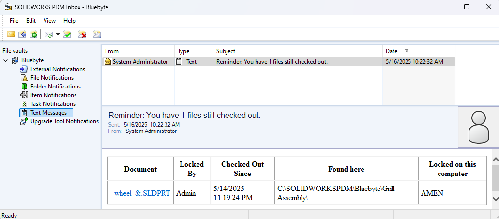

# PDMReminder

Thank you for choosing **[PDMReminder](https://bluebyte.biz/product/PDMReminder/)**!

PDMReminder is a SOLIDWORKS PDM task add-in that reminds users to check their files back into via email or PDM messaging engine.

Sample notification:

## Requirements

The minimum version PDMReminder supports is SOLIDWORKS PDM Professional 2017 SP0.  
> [!Tip]
> We highly recommend you use the latest version of PDM Professional.

## Installation

To install the PDMReminder add-in, you have two options:

1. **[Using CDPDM](/src/updateaddinswithcdpdm.html)**:  
   You can use **[CDPDM](/src/cdpdm.html)** to install the add-in directly from the cloud. This is the recommended method.

2. **[Using the CEX File](/src/installingpdmaddins.html)**:  
   Alternatively, you can download the `.cex` file from the order email you received after purchase. Once downloaded, import the `.cex` file into your vault via the Administration tool to complete the installation. 
   > [!Warning]
   > [Make sure to unblock the downloaded file.](/src/pdmqa.html)

## Configuration
Please see [setting up your first task](/src/pdmremindernewtask.html).

## Support

For additional support, please contact us through the **[contact](https://bluebyte.biz/contact/)** page.
