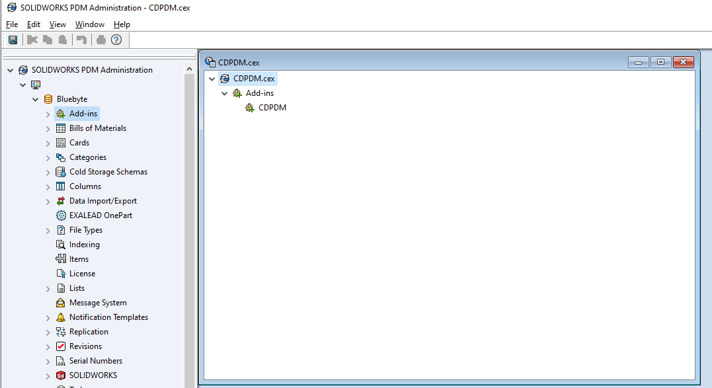
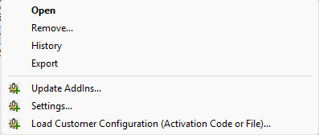
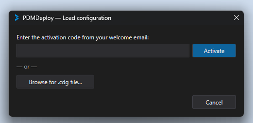
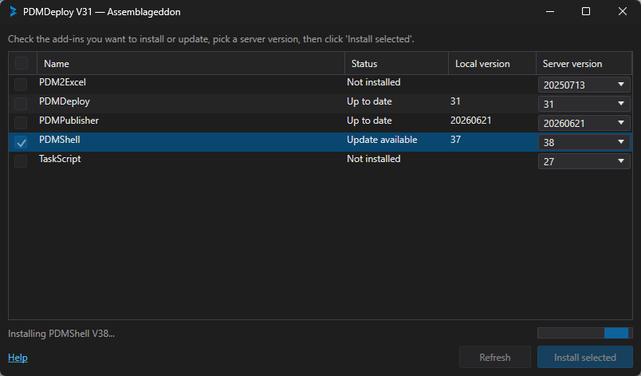

> [!IMPORTANT]
> CDPDM is now PDMDeploy. Starting with PDMDeploy V31, the add-in features a redesigned dark interface and activation codes. Older screenshots and video tutorials referencing CDPDM show the previous interface.

# Continuous Delivery

<video src="https://bluebyte.biz/wp-content/docsvideos/cdpdm.mp4" autoplay muted controls style="width: 100%; border-radius: 12px;"></video>

> [!NOTE]
> This video was recorded with an older version of PDMDeploy (CDPDM) and shows the previous interface. The workflow is the same. Refer to the screenshots below for the current interface (V31 and later).

PDMDeploy is a PDM add-in by Blue Byte Systems Inc. that facilitates the deployment of PDM and task add-ins developed for you.

The add-in communicates with our servers and allows the installation of all versions of your PDM add-ins.

## Advantages

The advantages of using PDMDeploy are numerous:

- No need to ask for or download CEX files.
- Ability to switch between versions.
- The conventional process of installing and updating add-ins is very tedious and time-consuming.

## Where to Find PDMDeploy

### Public download (Blue Byte Systems products)

PDMDeploy is publicly available:

### Download PDMDeploy

<a class="bbs-download-button" href="/pdmdeploy/PDMDeploy.cex">Download PDMDeploy</a>

### Public activation code

<code class="bbs-activation-code">E2A50448-9F15-42D9-B2F3-290409E81F94</code>

This activation code gives access to Blue Byte Systems products only (PDM2Excel, PDMPublisher, PDMShell, task add-ins, etc.). Our products require a valid license to run. Installing an add-in does not activate it.

### If we have developed a custom solution for you:

- Use the private activation code from your welcome email instead of the public one. It gives access to your custom add-ins and to our standard products if you own any.
- Alternatively, you may have received a Customer Configuration File (`.cdg`). It works the same way.

> [!NOTE]
> If you have purchased one of our PDM products and have had us develop a custom solution for you, please reach out to us so we can generate an activation code that lets you access all of your assets with a single code.

## How to Install

- Locate `PDMDeploy.cex`.
- In Windows 11, 10, and 7, internet downloads are blocked. Right-click on the CEX file, go to Properties, check Unblock, then click Apply and OK.
- Open the Administration tool.
- Log in to the vault. Please ensure you use a PDM user with Edit Add-Ins permission.
- In the Administration tool, click File > Open and browse to the `PDMDeploy.cex` file.
- Drag and drop the add-in from the CEX window onto the Add-ins node and wait for a few moments for PDMDeploy to be installed.

## Configuration

PDMDeploy needs to know which company assets you have access to. There are two ways to configure it. The activation code is the recommended one.

- Right-click on the PDMDeploy add-in and click *Load Customer Configuration (Activation Code or File)...*

- The configuration dialog opens:

### Option 1: Activation code (recommended)

- Type the activation code from your welcome email into the textbox and click *Activate*. PDMDeploy fetches your configuration securely from our servers. No file handling, no unblocking.

### Option 2: Customer Configuration File

- Click *Browse for .cdg file...* and select your Customer Configuration File.
- If the file was downloaded from the internet, unblock it first: right-click the file, select Properties, check Unblock, and click OK.

In both cases you will see a confirmation message once the configuration is loaded.

> [!NOTE]
> You can also configure PDMDeploy manually via the *Settings...* dialog by entering the credentials yourself. Contact support for help with this option.

> [!TIP]
> If you open *Update AddIns...* before configuring PDMDeploy, the add-in manager shows the activation panel directly. You can enter the activation code or browse to the `.cdg` file right there.

## Installing/Updating Add-ins

- Right-click on PDMDeploy under Add-ins in the Administration tool and click *Update AddIns...*
- The PDMDeploy window opens immediately and loads your add-ins in the background. The status bar at the bottom shows the progress: first your locally installed add-ins are read from the vault, then the available add-ins are retrieved from the server.

The window shows one row per add-in:

- Status: *Not installed*, *Update available*, or *Up to date* at a glance.
- Local version: the version currently installed in your vault.
- Server version: a dropdown with every version available on the server. The newest version is preselected.

To install or update:

1. Check the add-in(s) you'd like to install. The checkbox in the header row selects all add-ins at once.
2. Pick the version(s) from the Server version column if you need something other than the latest.
3. Click *Install selected*.

PDMDeploy will ask you if you want to restart PDM. This may be needed after every add-in update.

> [!NOTE]
> Please allow for a few moments after you click *Install selected*. Each add-in is downloaded, unblocked, and added to the vault. This operation includes suppressing some PDM dialog boxes. The status bar shows which add-in is currently being installed.
