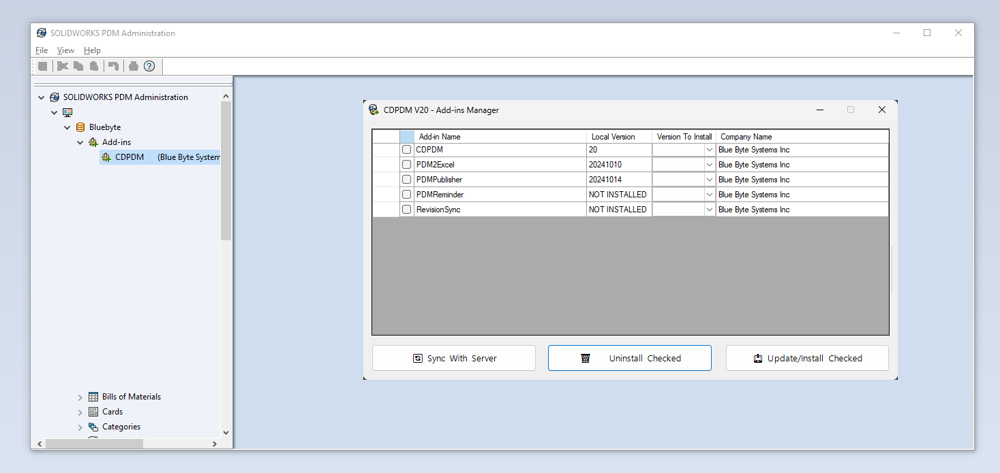

# Continuous Delivery

>[!NOTE]
> This is only available for consulting projects. Our product line has its own CD pipeline.

CDPDM is a PDM add-in by Blue Byte Systems Inc. that facilitates the deployment of PDM and task add-ins developed for you.

The add-in communicates with our servers and allows the installation and uninstallation of all versions of your PDM add-ins.

## Pros

The advantages of using CDPDM are numerous:

- No need to ask for or download CEX files.
- Ability to switch between versions.
- The manual installation process is very tedious and time-consuming.

## Where to Find CDPDM

- CDPDM is provided in your project kick-off email.
- The email contains:
  - Link to the CEX file.
  - Link to this page with installation instructions.
  - Link to your Customer Configuration File.

## How to Install

- Start by downloading the CEX file.
- In Windows 11, 10, and 7, internet downloads are blocked. Right-click on the CEX file, go to Properties, check Unblock, then click Apply and OK.
- Open the Administration tool.
- Log in to the vault. Please ensure you use a PDM user with Edit Add-Ins permission.
- In the Administration tool, click File > Open and browse to the `CDPDM.cex` file.
- Drag and drop the add-in from the CEX window onto the Add-ins node and wait for a few moments for CDPDM to be installed.

## Configuration
- Start by downloading the Customer Configuration File from the project kick-off e-mail.
- You can upload the Customer Configuration File via the Administration tool. 
- Right-click on the add-in and click Upload Customer Configuration File...
- Browse to the Customer Configuration File.

>[!NOTE]
> You can configure the settings of CDPDM by adding the credentials of the Customer Configuration File manually. Contact support for help.

## Updating Add-ins

- Right-click on CDPDM under Add-ins in the Administration tool and click Update Add-ins...
- This process may take a few moments depending on how many add-ins are in your vault.
- You will be prompted with a window like the following:

You can:

- Install the selected add-in from the list. From the Server Versions dropdown, you can select which version to install.
- Uninstall the add-in.

The installation process will ask you if you want to restart PDM. This may be beneficial to do after every upgrade, especially if you're validating a feature.
