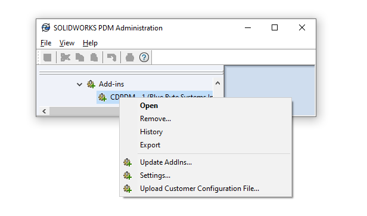

# Continuous Delivery

<video src="https://bluebyte.biz/wp-content/docsvideos/cdpdm.mp4" autoplay muted controls style="width: 100%; border-radius: 12px;"></video>

PDMDeploy is a PDM add-in by Blue Byte Systems Inc. that facilitates the deployment of PDM and task add-ins developed for you.

The add-in communicates with our servers and allows the installation of all versions of your PDM add-ins.

## Advantages

The advantages of using PDMDeploy are numerous:

 ✔️ No need to ask for or download CEX files.
 
 ✔️ Ability to switch between versions.
 
 ✔️ The conventional process of installing and updating add-ins is very tedious and time-consuming.

## Where to Find PDMDeploy

### If we have a developed a custom solution for you:

- PDMDeploy can be requested by via email and is mentioned during our customer onboarding process.

- You will need the following assets from Blue Byte Systems to start using PDMDeploy:

  - PDMDeploy CEX file.
  
  - Your Customer Configuration File.

### If you have purchased a PDM product from us:

- Your Blue Byte Systems Inc account has all the information you need. You can access your account from this link [here](https://bluebyte.biz/account).

- From the Downloads tab, please download the archive file that contains `PDMDeploy.cex` and the Customer Configuration File.

>[!NOTE]
> If you have purchased one of our PDM products and have had us develop a custom solution for you, please reach to us so we can generate a Customer Configuration File that lets you access all of your assets.

## How to Install

- Locate `PDMDeploy.cex`.

- In Windows 11, 10, and 7, internet downloads are blocked. Right-click on the CEX file, go to Properties, check Unblock, then click Apply and OK.

- Open the Administration tool.

- Log in to the vault. Please ensure you use a PDM user with Edit Add-Ins permission.

- In the Administration tool, click File > Open and browse to the `PDMDeploy.cex` file.

- Drag and drop the add-in from the CEX window onto the Add-ins node and wait for a few moments for PDMDeploy to be installed.

## Configuration

- Locate your Customer Configuration File.

- You can upload the Customer Configuration File via the Administration tool. 

- Right-click on the add-in and click *Upload Customer Configuration File...*
- Browse to the Customer Configuration File.

>[!NOTE]
> You can configure the settings of PDMDeploy by adding the credentials of the Customer Configuration File manually. Contact support for help with the *Settings...* dialog.

## Installing/Updating Add-ins

- Right-click on PDMDeploy under Add-ins in the Administration tool and click *Update AddIns...*

- This process may take a few moments depending on how many add-ins are in your vault.

- You will be prompted with a window like the following:

1. Check the add-in(s) you'd like to install.

2. Pick the version(s) from the Server Version column. 

3. Click on *Install Checked Add-Ins...* to install.

PDMDeploy will ask you if you want to restart PDM. This may be needed to do after every add-in update.

>[!NOTE]
> Please allow for a few moments after you click *Install Checked Add-Ins*. The add-in will be downloaded unblocked and added to the vault. This operation includes suppressing some PDM dialog boxes.