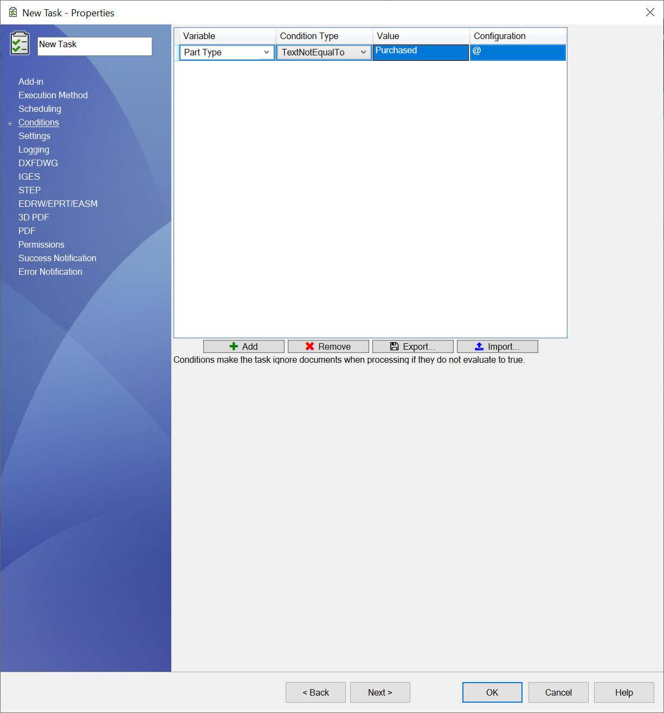

# Conditions Setup Page

Conditions can be added to a task to include or exclude files from being processed.  
The task will only process files that evaluate all of the set conditions as *true*.

> [!NOTE]
> The condition above for example will only allow files where the Part Type variable from the @ tab is different than the value Purchased.

To add a condition, *click* the ***Add*** button.

### Condition Options

|Option|Description|
|---|---|
|**Variable**|Variable name with the run the condition on.|
|**Condition Type**|Operation type to process.|
|**Value**|Value to evaluate the condition against.|
|**Configuration**|Configuration: Specify the configuration from which to get the value of the variable. Use @ in general.|
