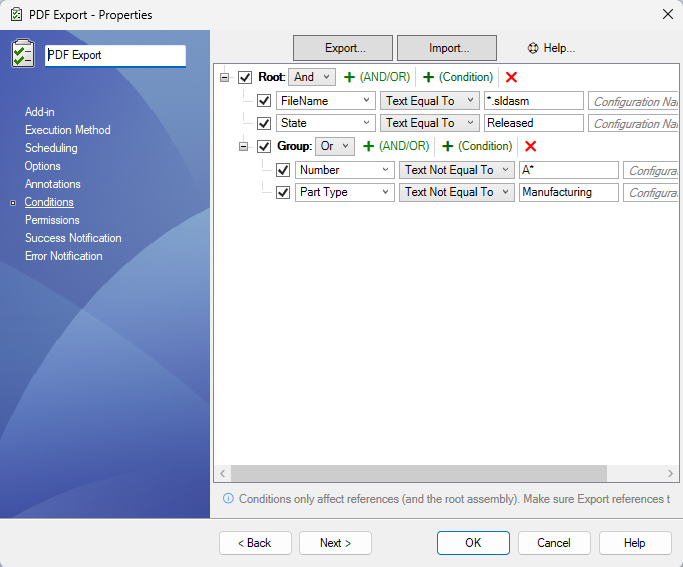

# Conditions Setup Page

Conditions can be added to a task to include or exclude files from being processed.  
The task will only process files that evaluate any of the set conditions as *true*.

> [!NOTE]  
> Conditions are applied to references of the top-level assembly (parts or sub-assemblies).

> [!WARNING]  
> PDMPublisher will evaluate only **one root condition** — whether it's a **single condition** or a **group** (AND/OR).  
> If multiple root-level conditions are present, only the **first one** will be considered.

##  Nested Groups Support (AND/OR)

PDMPublisher now supports **nested condition groups**, allowing you to create more advanced logical filters using **AND/OR** trees.

> [!TIP]
> You can add a new group by clicking the **+ (AND/OR)** button next to any condition group.

---

### Condition Options

| Option            | Description                                                                 |
|-------------------|-----------------------------------------------------------------------------|
| **Variable**       | Variable name to run the condition on.                                     |
| **Condition Type** | Type of comparison or rule to apply.                                       |
| **Value**          | Value to compare against.                                                  |
| **Configuration**  | Configuration to read the variable from (use `@` for general use).         |

---

### Special Variables

These built-in entries appear at the top of the variable list:

- **FileName**: File name (e.g. `123456.SLDDRW`)
- **Revision**: Current revision cached
- **Version**: Current version cached
- **Workflow**: Workflow name of the file
- **State**: Current state name of the file

---

### Operation Types

| Operation               | Description                                                                 |
|-------------------------|-----------------------------------------------------------------------------|
| **TextEqualTo**         | Checks if the text is exactly equal to the value. Supports `*` wildcard.   |
| **TextNotEqualTo**      | Checks if the text is not equal to the value.                              |
| **TextLengthLessThan**  | True if text length is less than the value.                                |
| **TextLengthBiggerThan**| True if text length is greater than the value.                             |
| **TextContains**        | True if the text contains the value.                                       |
| **TextDoesNotContain**  | True if the text does not contain the value.                               |
| **NumberEqualTo**       | True if number equals the value.                                           |
| **NumberNotEqualTo**    | True if number is not equal to the value.                                  |
| **NumberLessThan**      | True if number is less than the value.                                     |
| **NumberBiggerThan**    | True if number is greater than the value.                                  |
| **DateEqualTo**         | True if date equals the value.                                             |
| **DateNotEqualTo**      | True if date is not equal to the value.                                    |
| **DateLessThan**        | True if date is earlier than the value.                                    |
| **DateBiggerThan**      | True if date is later than the value.                                      |
| **YesOrNoEqualTo**      | True if value equals Yes or No.                                            |
