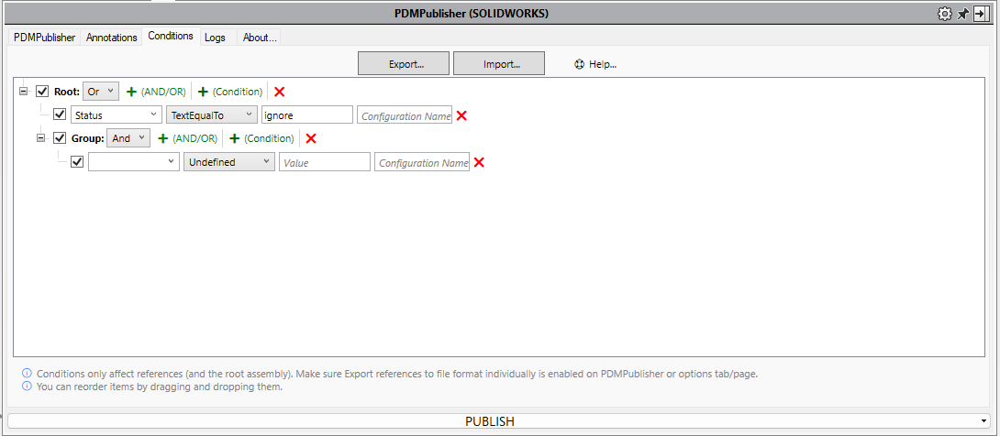

# Conditions Tab

    <a href="https://bluebyte.biz/wp-json/slm_custom/downloadpdmpublisher" class="download-button" style="display: inline-block; padding: 10px 20px; background-color: #0078d7; color: white; text-decoration: none; border-radius: 5px; font-weight: bold;">
        📥 Download PDMPublisher (free version)
    </a>
    <a href="https://bluebyte.biz/product/pdmpublisher-solidworks" class="download-button" style="display: inline-block; padding: 10px 20px; background-color:rgb(17, 78, 20); color: white; text-decoration: none; border-radius: 5px; font-weight: bold;">
        🛒 Purchase a License
    </a>

This section provides an overview of the **Conditions** tab and explains the available options for filtering which files are included in the publishing process.

---

## Conditions Output Dialog

From this dialog box, you can manually select which files to export. The dialog also displays useful information such as the number of assemblies, unique parts, and configurations identified during processing.

>[!NOTE]
>To disable this option, uncheck the **Show Conditions Output** Dialog checkbox located at the bottom of the Conditions tab.

---

## Creating and Using Conditions

Conditions act as filters to ensure only the desired files are processed. They work by evaluating the properties of each file and can be used to include or exclude files from the publishing process.

>[!NOTE]
>The add-in will only process files that evaluate any of the set conditions as '**true**'.

---

##  Nested Groups Support (AND/OR)

PDMPublisher for SOLIDWORKS supports **nested condition groups**, allowing you to create more advanced logical filters using **AND/OR** trees.

Individual conditions or entire condition groups can be enabled or disabled using their corresponding checkboxes on the left.

> [!TIP]
> You can add a new group by clicking the **+ (AND/OR)** button next to any condition group.

---

## Condition Options

| Option            | Description                                                                 |
|-------------------|-----------------------------------------------------------------------------|
| **Variable**       | Variable (file property) name to run the condition on. This is not case sensitive.         |
| **Condition Type** | Type of comparison or rule to apply.                                       |
| **Value**          | Value to compare against. This is not case sensitive.                      |
| **Configuration**  | Configuration to read the variable from (use `@` for general use).         |

### Special Variables

These built-in entries appear at the top of the variable list:

- **FileName**: File name (e.g. `123456.SLDDRW`)
- **Revision**: Current revision cached
- **Version**: Current version cached
- **Workflow**: Workflow name of the file
- **State**: Current state name of the file

### Condition Types

| Operation               | Description                                                                 |
|-------------------------|-----------------------------------------------------------------------------|
| **TextEqualTo**         | Checks if the text is exactly equal to the value. Supports `*` wildcard.   |
| **TextNotEqualTo**      | Checks if the text is not equal to the value.                              |
| **TextLengthLessThan**  | True if text length is less than the value.                                |
| **TextLengthBiggerThan**| True if text length is greater than the value.                             |
| **TextContains**        | True if the text contains the value.                                       |
| **TextDoesNotContain**  | True if the text does not contain the value.                               |
| **NumberEqualTo**       | True if number equals the value.                                           |
| **NumberNotEqualTo**    | True if number is not equal to the value.                                  |
| **NumberLessThan**      | True if number is less than the value.                                     |
| **NumberBiggerThan**    | True if number is greater than the value.                                  |
| **DateEqualTo**         | True if date equals the value.                                             |
| **DateNotEqualTo**      | True if date is not equal to the value.                                    |
| **DateLessThan**        | True if date is earlier than the value.                                    |
| **DateBiggerThan**      | True if date is later than the value.                                      |
| **YesOrNoEqualTo**      | True if value equals Yes or No.                                            |

---

### Order of Evaluation

**PDMPublisher for SOLIDWORKS** follows a specific order when evaluating variables and configurations:

1. **Configuration-Specific Property Lookup**  
   When evaluating a variable, **PDMPublisher for SOLIDWORKS** first tries to retrieve its value from the **referenced configuration** of the file.

2. **Fallback to Custom Tab**  
   If the property is **not found** in the referenced configuration, **PDMPublisher for SOLIDWORKS** will **fallback to the `Custom` tab** to retrieve the value.

3. **Assembly References with Empty Configuration Field**  
   When processing an **assembly**, if a condition has an **empty configuration field**, **PDMPublisher for SOLIDWORKS** will evaluate the condition **against the referenced configuration(s)** of the document (e.g. parts or subassemblies).

>[!NOTE]
> This behavior ensures maximum compatibility with different file property setups, especially in multi-configuration parts and complex assemblies.

---
### Import and Export

**Import** and **Export** functions are used to back up or deploy settings across multiple installations of **PDMpublisher for SOLIDWORKS**.

- The **Export** function creates a settings file that can be saved, shared, and imported into other installations of PDMpublisher for SOLIDWORKS.

- The **Import** function applies the settings contained within a settings file that was previously created using the Export process.