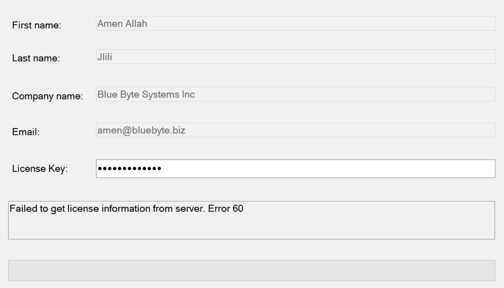

# License Common Issues 

If you attempt to deactivate and reactivate your license, you may get the following error: **Failed to get license information from the server. Error 60**

  

To solve this issue:
1. *Close* the ***Manage license...*** window.
2. *Right-click* on the add-in and *click* ***Manage license...***
3. *Add* your license key to the ***License Key*** field.
4. *Click* ***Activate*** to consume your license again. 