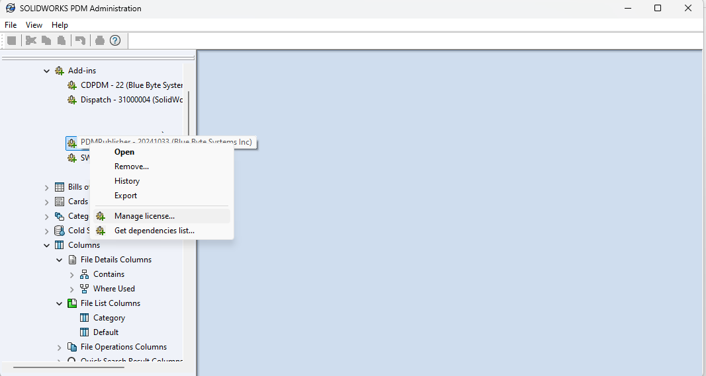
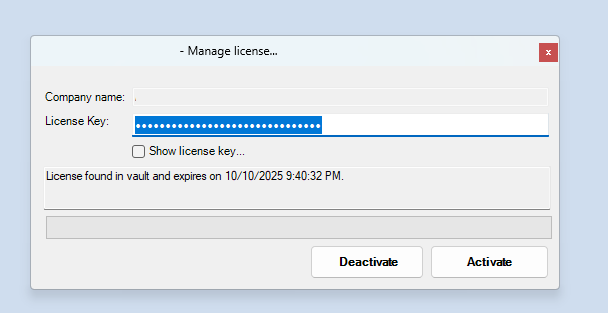
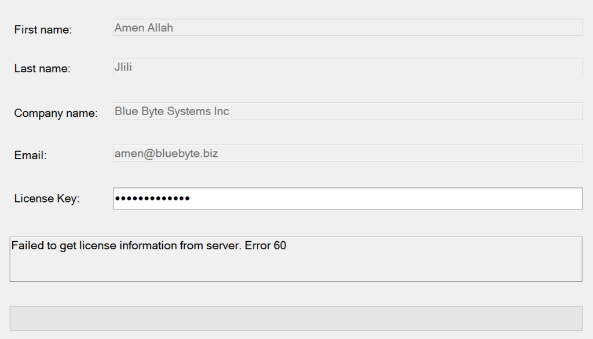

# License Information

This section denotes how to manage a license.

## Managing a License

Your license is made of a **secret key** that was provided to you in the *order confirmation email*.  

Your license entitles you to use PDM Convert Task Extended:

- for a specified duration.
- A number of domains (number of vaults where you can install the Add-in).

To manage your license:

- Log into your vault from the PDM Administration tool.
- *Right click* the Add-in from the **Add-ins** node and *select* ***Manage license...***

### Activating a license

To activate a license:
- *Enter* your license key and *click* ***Activate*** to consume the license from the **[previous step](#managing-a-license)**.

### Deactivating a license

To deactivate a license:
- *Click* ***Deactivate*** on the **[previous step**](#activating-a-license) to stop using the license on the logged in vault.

### Common Issues 

If you attempt to deactivate and reactivate your license, you may get the following error: **Failed to get license information from the server. Error 60**

To solve this issue:
1. *Close* the ***Manage license...*** window.
2. *Right click* on the Add-in and *click* ***Manage license...***
3. *Add* your license key to the ***License Key*** field.
4. *Click* ***Activate*** to consume your license again. 

## Renewing a License

To renew the license, please follow these instructions: 

> [!IMPORTANT]
> Do not commence the process below until you have your license key.

1. *Open* the PDM Administration tool, 
2. *Expand* the Add-in nodes and *right click* on PDM Convert Task Extended
3. *Click* ***Manage license…***
4. *Click* ***Deactivate*** (You must be connected to the Internet)
5. *Close* the window.
6. *Repeat* the process of clicking on Manage license…
7. *Enter* your license key and *click* ***Activate***
8. Your new expiry date should appear when the license is renewed. 

