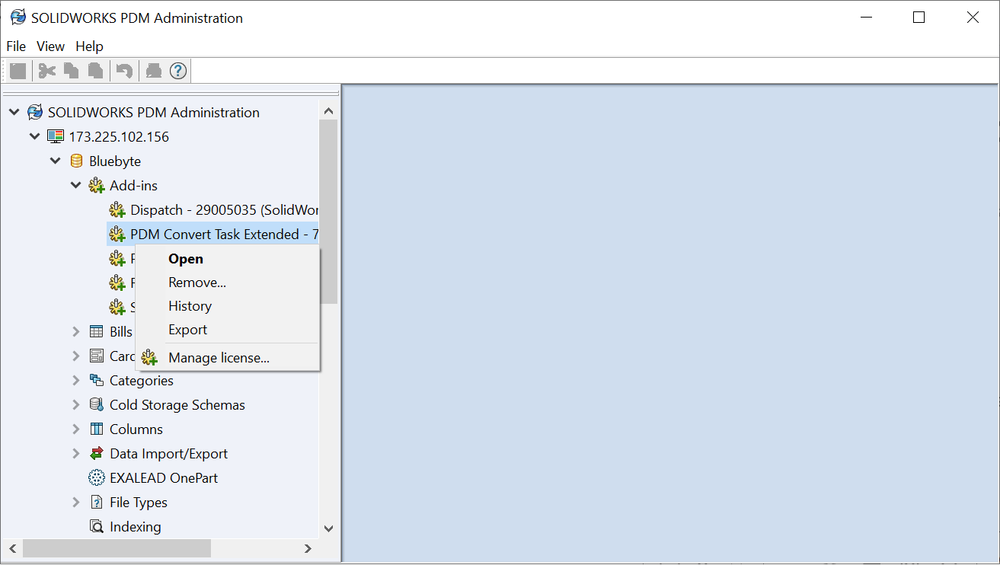
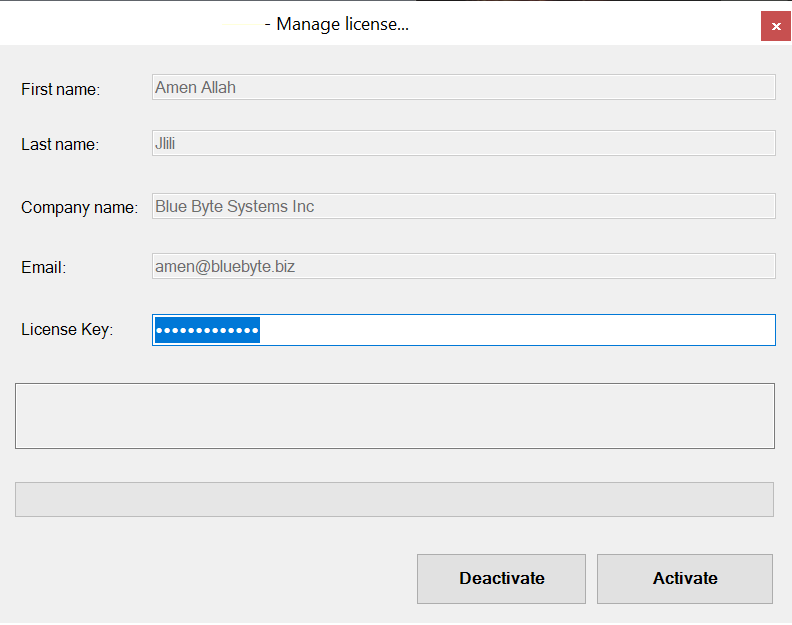

# License Information

This section denotes how to manage a license.

## Managing a License

Your license is made of a **secret key** that was provided to you in the *order email*.  

Your license entitles you to use PDM Publisher:

- For a specified duration.
- A number of domains (number of vaults where you can install the add-in).

To manage your license:

- Log into your vault from the PDM Administration tool.
- *Right-click* the add-in from the **Add-ins** node and *select* ***Manage license...***

  

### Activating a License

To activate a license:
- *Enter* your license key and *click* ***Activate*** to consume the license from the **[previous step](#managing-a-license)**.

  

### Deactivating a License

To deactivate a license:
- *Click* ***Deactivate*** on the **[previous step](#activating-a-license)** to stop using the license on the logged-in vault.

## To Reactivate a License

To reactivate the license, please follow these instructions:

1. *Open* the PDM Administration tool.
2. *Expand* the Add-in nodes and *right-click* on PDMPublisher.
3. *Click* ***Manage license…***
4. *Enter* your license key. If you are reactivating the same license key after expiry, you don't need to re-enter the license key. 
5. Click* ***Activate*** 
6. Your new expiry date should appear.
