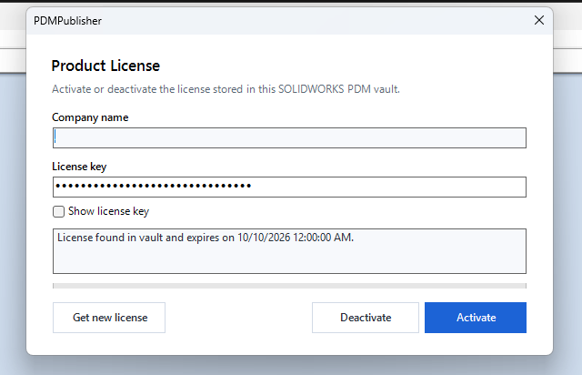

---
title: Licensing | PDMPublisher
description: Activate, deactivate, or request a PDMPublisher license for SOLIDWORKS or PDM Professional.
ms.date: 09/16/2026
ms.topic: conceptual
---

# License Information

## PDMPublisher for SOLIDWORKS

Open **PDMPublisher > License Key**, or open **PDMPublisher > Settings > License Key**.

| Control | What it does |
| --- | --- |
| **Company name** | Identifies the company associated with the license. |
| **License key** | Accepts the key supplied with the order or trial. |
| Eye button | Temporarily shows or hides the entered license key. |
| **Activate** | Activates the entered license on this computer. |
| **Deactivate** | Releases an active license from this computer. It is unavailable until a license is active. |
| **Buy license(s)** | Opens the PDMPublisher purchase page. |
| **Request New Trial** | Opens the trial-license request page. |

### Activate a SOLIDWORKS License

1. Enter the **Company name** exactly as supplied with the license.
2. Paste the **License key**.
3. Select **Activate**.
4. Confirm that the status area reports an active license.

Select **Deactivate** before moving a license to another computer, replacing the computer, or making a system change that could affect the machine identity.

### Community Edition

Without an activated paid or trial license, the page identifies the Community Edition limits:

- PDF, DXF, and STEP output only.
- Up to five references per run.
- Premium settings, including export locations by file format, are unavailable.

Use **Request New Trial** to evaluate the premium features, or see [Get a 7-day Trial](pdmpublishertrial.md).

## PDMPublisher for PDM Professional

### Managing a License

Your license is made of a **secret key** that was provided to you in the *order email*.

Your license entitles you to use PDM Publisher:

- For a specified duration.
- A number of domains (number of vaults where you can install the add-in).

To manage your license:

- Log into your vault from the PDM Administration tool.
- *Right-click* the add-in from the **Add-ins** node and *select* ***Manage license...***

  

### Activating a PDM Professional License

To activate a license:
- *Enter* your license key and *click* ***Activate*** to consume the license from the **[previous step](#managing-a-license)**.

### Deactivating a PDM Professional License

To deactivate a license:
- *Click* ***Deactivate*** in the license manager to stop using the license on the logged-in vault.

### Reactivate a PDM Professional License

To reactivate the license, please follow these instructions:

1. *Open* the PDM Administration tool.
2. *Expand* the Add-in nodes and *right-click* on PDMPublisher.
3. *Click* ***Manage license…***
4. *Enter* your license key. If you are reactivating the same license key after expiry, you don't need to re-enter the license key.
5. Click **Activate**.
6. Your new expiry date should appear.
