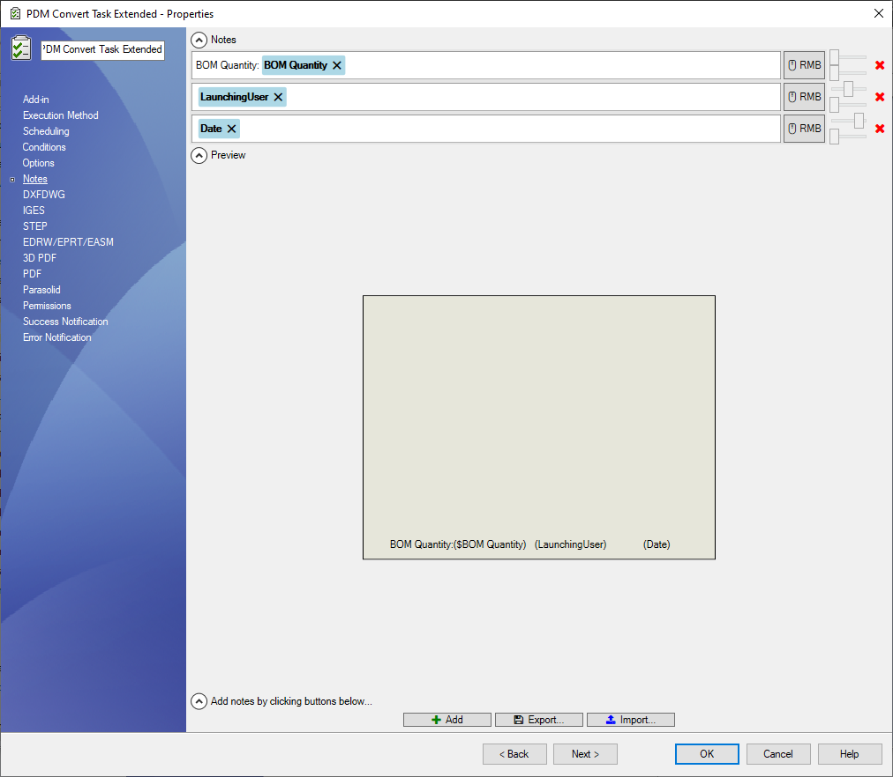

# Notes Setup Page

Notes can be added to converted PDF documents via this the ***Notes*** setup page.

To add a note, *click* the ***Add*** or ***Import...*** button.  
A note is defined by:

|Definition|Description|
|---|---|
|Location|Use the sliders on the right side of the note text area to define the location.|
|Value|The text area allows combinations of text and special values. The special values are evaluated for you during the task execution.|

