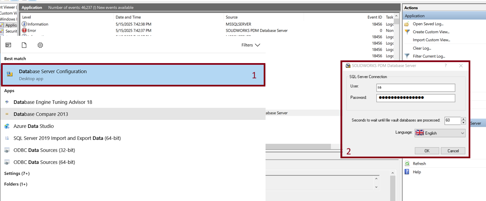
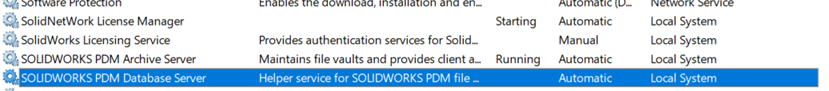

# FAQ: Ensuring Delivery of Email Notifications from Blue Byte Systems

If you are using the PDMReminder emailing service with the default parameters, it is important to ensure that you receive all notification emails from Blue Byte Systems. Below are answers to common questions about whitelisting and troubleshooting notification delivery.

---

### **Q: Why am I not receiving emails from Emailing Service?**

**A:**  
Some email providers or company firewalls may block or filter automated emails. To ensure you receive all notifications, please whitelist the domain **bluebyte.biz** in your email system or spam filter settings. This will help prevent important reminders and alerts from being marked as spam or blocked.

---

### **Q: What should I do if PDM notifications are not appearing in my inbox?**

**A:**  
SOLIDWORKS PDM notifications are sometimes delivered as internal inbox messages within the PDM client. If you are not receiving these notifications, it may be due to the **SOLIDWORKS PDM Database Service** not running on the server.  
To resolve this:
1. On the server, open **Database Server Configuration**.
2. Make sure the SQL connection is configured with the `sa` username and password:
 
3. Open the Windows Services management console (`services.msc`).
4. Locate **SOLIDWORKS PDM Database Service**:

5. Ensure the service is started. If it is stopped, right-click and select **Start**.

---

### **Q: What else can I do to ensure reliable notification delivery?**

**A:**  
- Regularly check your spam or junk folder for missed emails.
- Ask your IT department to allow emails from **bluebyte.biz**.
- Verify that your email address is correctly configured in the PDMReminder settings.

---

If you continue to experience issues, please contact [Blue Byte Systems Support](https://bluebyte.biz/contact/) for further assistance.