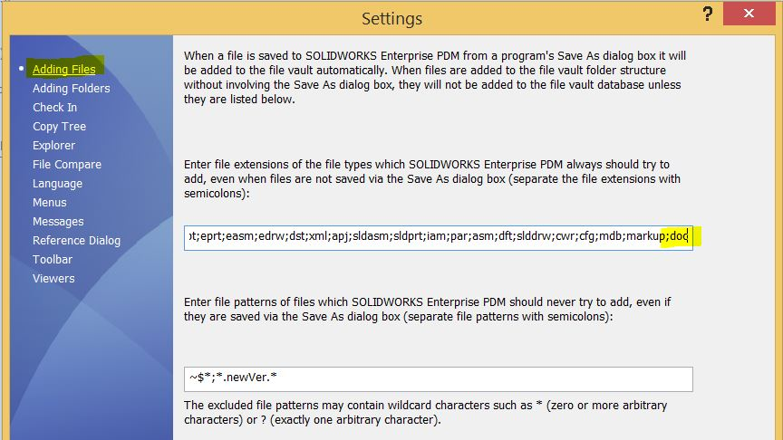

When you choose **PDMPublisher** from the dropdown in the new task dialog, you will be prompted with a window similar to the one below:

## Options Setup Page

## Output

| **Option** | **Description** |
|:--|:--|
| **Export Location** | Location where to export the files. The location can be within or outside the vault. It is important that the path does **not** end with a backslash (`\`). |
| **Extension-specific Location...** | Opens a dialog that allows you to customize the export location for each selected output extension independently. |
| **Filename** | Filename of the exported file. You do not need to include the extension. |
| **File Formats** | Specifies the available file formats to export documents to, including formats such as `PDF`, `DWG`, `DXF`, `U3D`, `IGS`, `STL`, `STEP`, `EPRT`, `EASM`, `HTML`, `X_T`, `3MF`, `IFC`, and `_3DPDF`. |
| **create reference from dest file to source file** | Creates a reference from the exported destination file to the source file. |
| **Use @ Tab to Evaluate Paths.** | Uses the `@` configuration tab to evaluate variables in the export location and filename. |

---

## Duplicating Handling

| **Option** | **Description** |
|:--|:--|
| **Delete duplicates outside the destination folder** | Deletes duplicate files that exist outside the destination folder. |

---

## Export

| **Option** | **Description** |
|:--|:--|
| **Merge exported PDFs into one master PDF** | Combines all exported PDFs of the affected assembly into one master PDF file instead of keeping them separate. |
| **Ignore sub-assemblies children when condition checks fail** | When enabled, the children of sub-assemblies that fail the condition check will be ignored and not processed. |
| **Export affected document** | Exports the affected top-level document. |
| **Export references to file formats individually** | When enabled, references of the active document are exported individually to the selected file formats. This does not affect merging or archiving when disabled. |
| **Work with latest version** | Ensures that the task works with the latest version of the file by retrieving the newest version from the vault before processing. |
| **Quick view mode (Drawings Only)** | Opens drawings in Quick View mode to improve performance, especially for larger drawings. |
| **Use Microsoft Print To PDF to save PDFs** | Uses Microsoft Print to PDF when generating PDF output. |
| **Convert multiple configurations** | If enabled, the task will attempt to export all part and assembly configurations. The configurations will be saved with the configuration name appended to the filename. |
| **Configuration Filter** | Allows the user to control which configurations are processed. `*` is a wildcard that matches any sequence of characters. Additionally, the user can exclude specified configurations. |
| **Map variables between source and destination file** | Enables mapping of variables between the source file and the exported destination file. |
| **Variable Mapping...** | Opens the variable mapping dialog where source and destination variables can be configured. |
| **Ask user to select configuration on startup** | If enabled, the task will prompt the user to select which configuration of the affected document to process on startup. |
| **Archive all exported documents (.zip)** | Packages all exported documents into a single `.zip` file for easy storage and distribution. |
| **Export sheet metal parts to 1:1 flat pattern DXF** | Exports sheet metal parts as DXF files in a 1:1 scale. |
| **Flat Pattern Settings** | Opens a dialog to configure how the flat pattern DXF is created. |
| **Use search to locate drawings** | When enabled, the task will search in the vault for the first drawing that references the affected document when a matching drawing cannot be found in the same folder. |

### Flat Pattern Settings

When **Export sheet metal parts to 1:1 flat pattern DXF** is enabled, the **Flat Pattern Settings** dialog provides the following options:

- **Export flat-pattern geometry**: Exports the flattened part geometry.
- **Include hidden edges**: Adds hidden edges to the exported geometry.
- **Export bend lines**: Adds bend lines to the flat pattern.
- **Include sketches**: Exports sketches to the DXF.
- **Merge coplanar faces**: Merges adjacent faces lying in the same plane.
- **Export library features**
- **Export forming tools**
- **Export bounding box**: Adds a bounding box around the flattened part geometry.
- **Only export the inner diameter of countersink holes**: This only works with countersinks created using the Hole Feature.
- **Append `FlatPattern` to the flat pattern DXF file name**: Helps avoid overwriting files when a `.SLDDRW` file is also exported to DXF.

---

## Export History

| **Option** | **Description** |
|:--|:--|
| **Turn on activity tracking** | Enables tracking of all task activity and generates a detailed log file documenting each step performed by the task. |
| **Server-Synced Activity Logs** | Sends activity logs to the server for centralized storage and review. |
| **Log Folder (Vault Only)** | Specifies the folder in the PDM vault where the task log files will be stored. This path must be inside the vault and must **not** end with a backslash (`\`). |

---

## BOM

| **Option** | **Description** |
|:--|:--|
| **Template** | Specifies the BOM template to be used. Users can select from the available BOM layouts in the vault. |
| **Calculation method** | Defines how the BOM is calculated. Options include **As Built** and **Latest**. |

### Calculation Methods

| **Method** | **Description** |
|:--|:--|
| **As Built** | Same references when the assembly was checked in. |
| **Latest** | Latest references of the assembly. |

---

## Table of Content

| **Option** | **Description** |
|:--|:--|
| **Add table of content to merged PDF** | When enabled, a table of contents is automatically generated and inserted into the merged PDF, making it easier to navigate and reference the document. |
| **Table columns** | Specifies the information included in the table of contents. Available options are **Just Name**, **Name and Quantity**, and **Custom**. |
| **Customize Table...** | Opens a dialog that allows you to choose the custom columns to include in the table of contents. |

---

## SOLIDWORKS

| **Option** | **Description** |
|:--|:--|
| **Use this version of SOLIDWORKS** | Specifies which version of SOLIDWORKS to use for processing the files. Options range from specific years to the latest available version. |

---

## PDF bookmarks

| **Option** | **Description** |
|:--|:--|
| **PDF bookmarks** | Allows you to define the text pattern for the bookmarks section in the merged PDF, making it easier to navigate between sections within the document. |

---

## Ensuring Proper BOM Layout for PDMPublisher

In recent versions, PDMPublisher uses the **PDM BOM** instead of the SOLIDWORKS BOM. PDMPublisher leverages the **first BOM layout in your vault** to calculate quantities.

To ensure proper functionality, the layout must include:

- `<RefCount>` for the quantity
- `<Configuration>` for the configuration name

If you are experiencing BOM-related errors, verify that these required columns are present in your BOM setup.

> [!TIP]
> We recommend disabling the auto-add extensions by removing all the extensions the task uses, including `txt`.  
> This helps prevent race conditions between SOLIDWORKS PDM and the task during the file add process.

To change the auto-add extensions list:

1. *Go to* the **PDM Administration** tool
2. *Right-click* on the username, or **All Users**
3. *Select* **Settings**
4. *Click* on **Adding Files**
5. Edit the file extensions list

  

