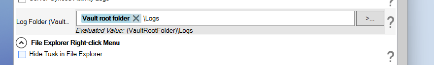

When you choose **PDMPublisher** from the dropdown in the new task dialog, you will be prompted with a window similar to the one below:

## Options Setup Page

### Export Location

**Export Location** defines where PDMPublisher exports the generated files. The location can be inside or outside the vault. Make sure the path does **not** end with a backslash (`\`).

**Extension-specific Location...** opens a dialog where you can define a separate export location for each selected output extension.

**Filename** defines the exported file name. You do not need to include the file extension.

**File Formats** defines the formats PDMPublisher can export to, including `PDF`, `DWG`, `DXF`, `U3D`, `IGS`, `STL`, `STEP`, `EPRT`, `EASM`, `HTML`, `X_T`, `3MF`, `IFC`, `BMP`.

**Create reference from destination file to source file** creates a PDM reference from the exported destination file back to the original source file.

**Use @ Tab to Evaluate Paths** uses the `@` configuration tab when evaluating variables used in the export location and filename.

---

### Duplicate Handling

**Delete duplicates outside the destination folder** deletes duplicate files that exist outside the configured destination folder.

---

### Export Options

**Merge exported PDFs into one master PDF** combines all exported PDFs from the affected assembly into one master PDF instead of keeping them as separate files.

**Ignore sub-assemblies children when condition checks fail** prevents PDMPublisher from processing the children of sub-assemblies when the sub-assembly itself fails the condition check.

**Export affected document** exports the affected top-level document.

**Export references to file formats individually** exports references of the active document individually to the selected file formats. Disabling this option does not affect PDF merging or ZIP archiving.

**Work with latest version** retrieves the latest version of the file from the vault before processing.

**Quick view mode (Drawings Only)** opens drawings in Quick View mode to improve performance, especially for large drawings.

**Use Microsoft Print To PDF to save PDFs** uses Microsoft Print to PDF when generating PDF output.

**Convert multiple configurations** exports all part and assembly configurations. The configuration name is appended to the exported filename.

**Configuration Filter** controls which configurations are processed. The `*` character can be used as a wildcard. You can also exclude specific configurations.

**Map variables between source and destination file** enables variable mapping between the source file and the exported destination file.

**Variable Mapping...** opens the variable mapping dialog where source and destination variables can be configured.

**Ask user to select configuration on startup** prompts the user to select the configuration to process when the task starts.

**Archive all exported documents (.zip)** packages all exported documents into a single `.zip` file.

**Export sheet metal parts to 1:1 flat pattern DXF** exports sheet metal parts as 1:1 scale DXF flat patterns.

**Flat Pattern Settings** opens the dialog used to configure the flat pattern DXF export options.

**Use search to locate drawings** searches the vault for the first drawing that references the affected document when a matching drawing cannot be found in the same folder.

---

### File Explorer Right-Click Menu

This option hides the task name from appearing under **Tasks** in the File Explorer right-click menu. This allows PDM administrators to hide the task from users while still allowing the task to run from a workflow transition.

---

### Flat Pattern Settings

When **Export sheet metal parts to 1:1 flat pattern DXF** is enabled, the **Flat Pattern Settings** dialog controls how the DXF is generated.

**Export flat-pattern geometry** exports the flattened sheet metal geometry.

**Include hidden edges** adds hidden edges to the exported DXF.

**Export bend lines** includes bend lines in the flat pattern.

**Include sketches** exports sketches to the DXF.

**Merge coplanar faces** merges adjacent coplanar faces into the exported output.

**Export library features** includes library features in the DXF export.

**Export forming tools** includes forming tools in the DXF export.

**Export bounding box** adds a bounding box around the flattened part geometry.

**Only export the inner diameter of countersink holes** exports only the inner diameter of countersink holes. This option only works with countersinks created using the Hole Wizard feature.

**Append `FlatPattern` to the flat pattern DXF file name** appends `FlatPattern` to the DXF file name. This helps avoid overwriting files when a `.SLDDRW` file is also exported to DXF.

---

### Export History

**Turn on activity tracking** enables detailed task logging. This log records the activity performed by the task.

**Server-Synced Activity Logs** sends task logs to the server for centralized storage and review.

**Log Folder (Vault Only)** defines the vault folder where task log files are stored. This folder must be inside the vault, and the path must **not** end with a backslash (`\`).

---

### BOM Settings

**Template** defines the BOM template used by PDMPublisher. Users can select from the available BOM layouts in the vault.

**Calculation method** defines how the BOM is calculated. Available options include **As Built** and **Latest**.

**As Built** uses the references from the version of the assembly that was checked in.

**Latest** uses the latest references of the assembly.

> [!IMPORTANT]
> PDMPublisher uses BOM layouts to calculate quantities when quantities are used in the printed PDF as custom annotations.

---

### Table of Contents

**Add table of content to merged PDF** automatically inserts a table of contents into the merged PDF.

**Table columns** defines the information included in the table of contents. Available options are **Just Name**, **Name and Quantity**, and **Custom**.

**Customize Table...** opens a dialog where you can choose the custom columns to include in the table of contents.

---

### SOLIDWORKS Version

**Use this version of SOLIDWORKS** specifies which SOLIDWORKS version PDMPublisher should use to process files. The list can include specific installed versions and the latest available version.

---

### PDF Bookmarks

**PDF bookmarks** defines the text pattern used to create bookmarks in the merged PDF. Bookmarks make it easier to navigate between sections in the exported PDF package.

---

### Ensuring Proper BOM Layout for PDMPublisher

In recent versions, PDMPublisher uses the **PDM BOM** instead of the SOLIDWORKS BOM. PDMPublisher uses the **first BOM layout in your vault** to calculate quantities.

To work correctly, the BOM layout must include the following columns:

- `<RefCount>` for the quantity
- `<Configuration>` for the configuration name

If you are experiencing BOM-related errors, verify that these required columns exist in your BOM layout.

> [!TIP]
> We recommend disabling auto-add extensions for all extensions used by the task, including `txt`.
>
> This helps prevent race conditions between SOLIDWORKS PDM and the task during the file add process.

To change the auto-add extensions list:

1. Open the **PDM Administration** tool.
2. Right-click the username or **All Users**.
3. Select **Settings**.
4. Click **Adding Files**.
5. Edit the file extensions list.

  

