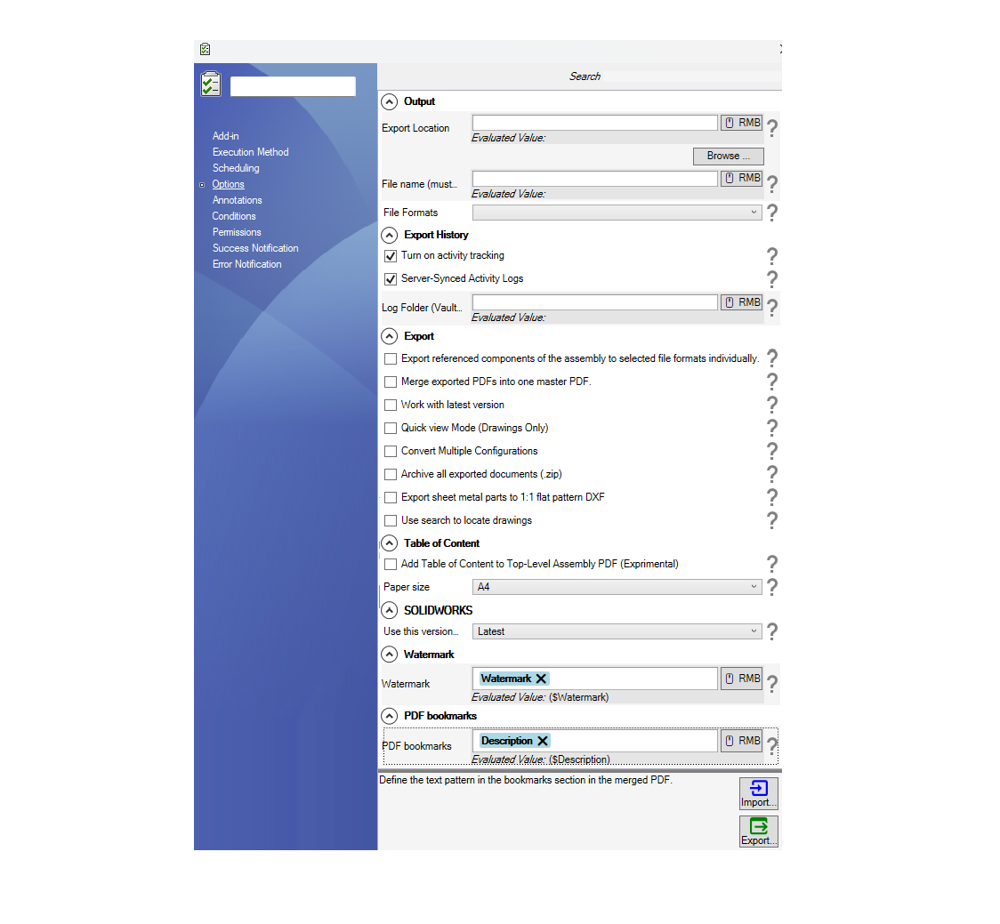

## Options Setup Page

When you choose PDM Publisher from the dropdown in the new task dialog, you will be prompted a window that is similar to the one below:

  

| Option | Description |
|:---|:---|
| **Output** | This is where you specify the **location** and the **filename** where you want the exported documents to be saved. This location can be inside or outside the vault. |
| **File Formats** | This section specifies the file formats available for export. |
| **Export History** | <ul><li>**Turn on activity tracking**: Enables tracking of activity.</li><li>**Server-Synced Activity Logs**: Logs are synchronized with the server.</li><li>**Log Folder (Vault)**: Specify the location in the vault where logs are stored.</li></ul> |
| **Export** | <ul><li>**Export referenced components of the assembly to selected file formats individually**: Exports each referenced component to the chosen file format.</li><li>**Merge exported PDFs into one master PDF**: Merges all exported PDFs into a single file.</li><li>**Work with latest version**: Task will work with the latest version of the file.</li><li>**Quick view Mode (Drawings Only)**: Opens documents in quick view for better performance with large drawings.</li><li>**Convert Multiple Configurations**: Attempts to export all configurations.</li><li>**Archive all exported documents (.zip)**: Creates a zip file of all processed documents.</li><li>**Export sheet metal parts to 1:1 flat pattern DXF**: Exports sheet metal parts as DXF files.</li><li>**Use search to locate drawings**: Allows using search functionality to find drawings.</li></ul> |
| **Table of Content** | <ul><li>**Add Table of Content to Top-Level Assembly PDF**: Includes a table of contents in the top-level assembly PDF or a simple BOM. The simple BOM has description column and a quantity column.</li><li>**Paper size**: Size of the page used for the table of content of the simple BOM.</ul> |
| **watermark** | Add a watermark to the printed PDF. This watermark is an evaluated expression. You can include a mix of text and variables. |

### Important Notes About Creating Tasks

Please consider the following recommendations when creating a new task using PDM Publisher:
1. **Execution method**
    1. In the execution method tab that appears on the blue left sidebar, please: 
    2. Choose the radio box option **“Let the system decide which computer to execute the task“**.
    3. Choose **one computer**. We recommend that our customers opt for the server. The server needs to have a SOLIDWORKS PDM Client installed with a local view as well as SOLIDWORKS 3D.
2. On the first page of the task, execute the task with a user that has the right workflow and file/folder permissions.

> [!TIP]
> We also recommend disabling the auto-add extensions by removing all the extensions the task uses including txt.  
> This prevents race conditions between SOLIDWORKS PDM and the task during files add process.

To change the auto-add extensions list, 
1. *Go to* the PDM Administration tool
2. *Right click* on the username (or all users)
3. *Select* ***Settings***
4. *Click* on the ***Adding Files*** selection and edit the file extensions

  

