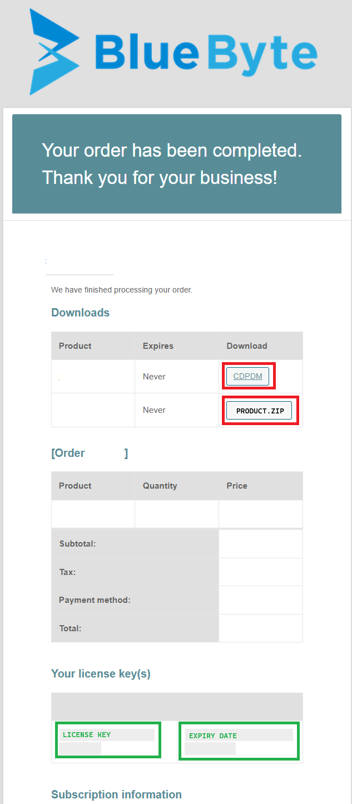

# Updating PDM2Excel with CDPDM

This article is about updating the PDM2Excel add-in using the CDPDM add-in, developed by Blue Byte Systems, Inc. This tool streamlines the code delivery process for SOLIDWORKS PDM customers by utilizing the CDPDM continuous delivery platform. It allows you to access and update your purchased add-ins and all their versions efficiently.

### Installation Steps:

1. **Download the CDPDM add-in**: The link is provided in your order confirmation and is also available in the downloads section of your account.

2. **Unblock the downloaded file**: Right-click on the zip archive and select **Properties**. In the properties dialog, check the **Unblock** option and click **OK**.
3. **Unzip the archive**: Extract the contents of the zip archive.
4. **Open the administration tool**: Log into your vault.
5. **Import the add-in**:
    - Go to **File > Open** and browse to `CDPDM.cex` (unzipped content).
    - Click **OK** to open the CEX file.
    - Drag and drop the CDPDM add-in icon onto the add-ins node in the administration tool. This will add the add-in into the add-ins node.
6. **Upload the customer configuration file**:
    - Locate the customer configuration file from your order confirmation email.
    - Unblock the downloaded configuration file: Right-click on the file, select **Properties**, check the **Unblock** option, and click **OK**.
    - Right-click on the CDPDM add-in and click on **Update customer configuration file...**
    - Browse to the unblocked customer configuration file and upload it.

### Updating an Add-in:

1. Right-click on the CDPDM add-in and click on **Update add-ins…**
2. This will show the main dialog of the add-in where you can select from the dropdown list the program you would like to install.
3. Click on the **Install** button to install the selected add-in.
4. The process might take a few moments, so please wait.
5. You will be prompted at the end to restart your PDM session. This allows your local client to get the new version of the installed add-in.
6. You may want to restart the administration tool (conisioadmin.exe) so the add-in reloads properly before you consume your license or create/edit your tasks.
### Warnings

> [!Warning]
> You must back up your tasks. The CDPDM add-in does not update your existing tasks or permit the add-in the *Task Host Configuration*.

> [!Warning]
> All client computers using the add-in's tasks must be restarted to use the new version.