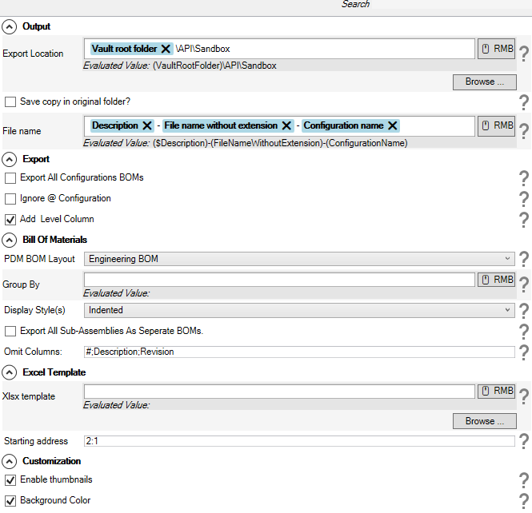

# Options

The Options setup tab allows you to define the characteristics of the BOM you would like to export.

  

|Option|Description|
|---|---|
|Export Location|Specify a location where to export the xlsx BOM. Right-click on the RMB to insert dynamic variables into the path.    For example, to export your bill of materials to a location in the vault, you can use the vault root folder dynamic variable. The add-in will evaluate it to the actual path of the local vault view where the export operation will be executed.   The list of dynamic variables are:  <ul><li>Vault root folder<ul><li>Path to the local vault view root folder</li></ul></li><li>File name without extension<ul><li>Name of the assembly file without extension.</li></ul></li><li>File name<ul><li>Name of the assembly file including the extension (sldasm).</li></ul></li><li>Configuration name<ul><li>Name of the configuration if available.</li><li>@ configuration is evaluated to **At**.</li></ul></li><li>Revision<ul><li>PDM Revision of the assembly.</li></ul></li><li>Version<ul><li>PDM Version number of the assembly.</li></ul></li><li>Date<ul><li>The current date time in the following format **yyyy-mm-dd**.</li></ul></li><li>Extension<ul><li>Extension of the affected document.</li></ul></li><li>User<ul><li>Username of the session's user where the export process will be executed.</li></ul></li><li>Launching user<ul><li>Name of the user that launched this operation.</li><li>Please use this only if the add-in is configured to be used as a task.</li></ul></li><li>PDM Variables<ul><li>Value of the PDM Variable for the affected documents.</li><li>Please make sure the Variable name does not contain any illegal path characters.</li></ul></li></ul>|
|Save copy in original folder?|If the checkbox is checked, the task will save the xlsx BOM in the folder of the original document.|
|File name|The name of the exported xlsx.|
|Configuration options|<ul><li>Print all configurations<ul><li>Print all the configurations.</li></ul></li><li>Ignore @ configuration<ul><li>Ignores the @ configuration</li></ul></li></ul>|
|Templates|<ul><li>PDM BOM Layout<ul><li>The name of the BOM layout to use</li></ul></li><li>Xlsx template<ul><li>Use this if you want to include your company header in the exported bill of materials</li></ul></li><li>Start address<ul><li>The address where the add-in will add the BOM data.</li><li>By default, this is 1:1 (i.e. row one and column one or cell A1) but this will change depending on your template.</li></ul></li></ul>|
|Hyperlink|<ul><li>Hyperlink the filename column<ul><li>Adds a conisio link that directly opens the row's affected document in file explorer.</li><li>This does not apply to weldment rows.</li></ul></li><li>Enable hyper to web2client<ul><li>Adds a hyperlink to the filename that opens the row's associated document in the web2 client interface (PDM in the browser).</li></ul></li><li>Web2client<ul><li>Base URL of your web2client</li></ul></li></ul>|
|Columns|<ul><li>Add level column<ul><li>Add a level column.</li><li>Use this when the BOM display style is set to be indented.</li></ul></li><li>Add parent column<ul><li>Add the parent column to the bill of materials.</li></ul></li><li>Ignore columns<ul><li>Name of the columns to ignore.</li><li>Separate column names with **;** (Column1;Column2;etc...).</li></ul></li></ul>|
|Developer mode|<ul><li>Adds advanced error message for debugging.</li><li>Only use this when directed by tech support.</li></ul>|
|Thumbnails|<ul><li>You need the document key manager to be able to use this feature. Request from the ? button.</li><li>Export location<ul><li>Specify the export location where you want to save the thumbnails as separate pngs.</li></ul></li></ul>|
|Bill of Materials Settings|<ul><li>Display state<ul><li>Intended</li><li>Parts only</li><li>Top level</li></ul></li><li>Process all sub-assemblies<ul><li>Process all sub-assemblies into separate bill of materials</li></ul></li><li>Top-level assembly row<ul><li>Add the top-level assembly as the 0th row.</li></ul></li></ul>|

> [!NOTE]
> The Export and Import button allows you to save your settings and import them after upgrading. Only use them with task setup.