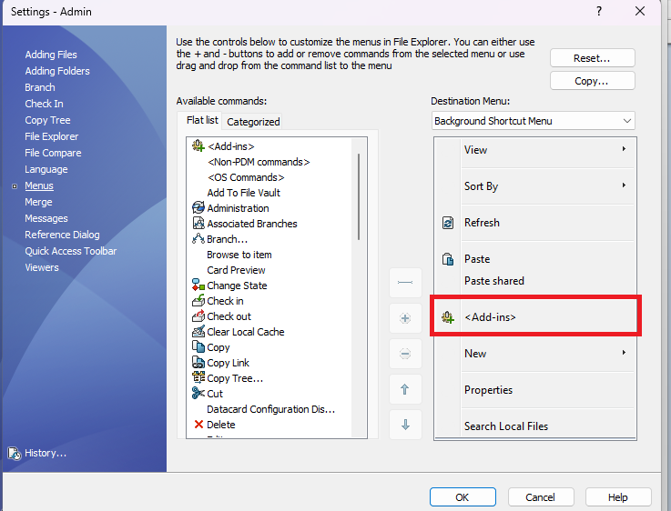

# Why is the Tasks menu missing?

If the **Tasks** menu does not appear in File Explorer, the PDM user settings may be hiding add-ins.

Open the SOLIDWORKS PDM Administration tool, open the user settings dialog, and confirm add-ins are visible for that user.

  

After add-ins are visible, reopen File Explorer and right-click a file in the vault. The task should appear under **Tasks**.
