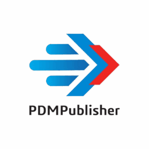

---
title: PDMPublisher | SOLIDWORKS PDM
description: Learn about PDMPublisher for SOLIDWORKS PDM Professional, including supported export formats, input files, requirements, installation, and licensing.
ms.date: 06/19/2026
ms.topic: overview
---

# PDMPublisher

Thank you for choosing [PDMPublisher](https://bluebyte.biz/product/pdmpublisher/)! 

> [!NOTE]
> [Please consult the FAQ section to get answers for the most asked questions.](../src/pdmpublisherfaq.html)

PDMPublisher is a SOLIDWORKS PDM task add-in that lets you save your SOLIDWORKS files using advanced filters and provides power capabilities to place custom properties/datacard, BOM quantities on PDFs and merge them.  

## Supported extensions
With the PDM task version of PDMPublisher, you can export to the following extensions:

- `pdf`: 
  - SOLIDWORKS drawings as `pdf`.
  - SOLIDWORKS parts and assemblies as 3D `pdf`
  - Office documents (Word and Excel) as `pdf`
- `dxf` (You can also export the flat pattern of sheet metal parts)
- `dwg`
- `step`
- `iges`
- `x_t`
- `x_b`
- `stl`
- `u3d`
- `eprt`
- `edrw`
- `easm`
- `ifc`
- `3mf`
- `html` (eDrawings Professional required)

## Input files
PDMPublisher can process individual SOLIDWORKS part files (`.sldprt`), drawing files (`.slddrw`), and assemblies (`.sldasm`) along with all their references. This ensures that all necessary components are correctly handled during processing, whether you're converting a single file or an entire assembly structure.  

- Single Part (`.sldprt`): Processes and converts a part file to the extensions above.  
- Single Drawing (`.slddrw`): Processes individual drawings.  
- Assembly with References (`.sldasm`): Automatically includes all referenced parts and subassemblies and their drawings.  
- Microsoft Office Word and Excel: Office documents to PDF.

## Requirements

The minimum version PDMPublisher supports is SOLIDWORKS PDM Professional 2018 SP0.  
> [!TIP]
> We highly recommend you use the latest version of PDM Professional.

## Installation

To install the PDMPublisher, you have two options:

1. [Using PDMDeploy](/src/updateaddinswithcdpdm.html):  
   You can use [PDMDeploy](/src/cdpdm.html) to install the add-in directly from the cloud. This is the recommended method.

2. [Using the CEX File](/src/installingpdmaddins.html):  
   Alternatively, you can download the `.cex` file from the *order email* you received after purchase. Once downloaded, import the `.cex` file into your vault via the Administration tool to complete the installation.
    > [!WARNING]
    > [Make sure to unblock the downloaded file.](/src/pdmqa.html)

## Consuming your license key

- The step requires that you have PDMPublisher added to your vault.
- Before you can start using PDMPublisher, you must activate the product using the license key provided in the *order email*. To activate or deactivate your license, please follow the instructions in this [article](/src/licensespdmpublisher.html).  

## Creating your first task
Please follow the instructions in this [article](/src/propertiespagepdmpublisher.html).  

## Support
For additional support, please contact us through the [contact](https://bluebyte.biz/contact/) page or via our support email support@bluebytesystemsinc.zohodesk.com.

> [!NOTE]
> Before reaching out, we highly suggest you read the content of this page. We have compiled these help topics to respond to the frequently asked questions by our customers.
