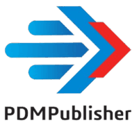

# PDM Publisher

Thank you for choosing **[PDM Publisher](https://bluebyte.biz/product/pdmpublisher/)**! 

> [!Note]
> **[Please consult the FAQ section to get answers for the most asked questions.](../src/pdmpublisherfaq.html)**

PDM Publisher is a SOLIDWORKS PDM task add-in that lets you **save** your SOLIDWORKS files using advanced filters and provides power capabilities to place **custom properties/datacard**, **BOM quantities** on PDFs and **merge** them.  

It can convert SOLIDWORKS files to the following extensions:

1. **PDF (Portable Document Format)**: A versatile format for sharing documents that preserves formatting across different devices.
2. **DWG (Drawing)**: A file format used in AutoCAD for creating and editing 2D and 3D drawings.
3. **DXF (Drawing Exchange Format)**: A format designed for interoperability between AutoCAD and other software, facilitating data exchange.
4. **U3D (Universal 3D)**: A file format for 3D models, commonly embedded in documents to provide interactive 3D visualization.
5. **STL (Stereolithography)**: A widely used format for 3D printing that represents the surface geometry of a 3D object.
6. **STEP (Standard for the Exchange of Product Model Data)**: A format that enables compatibility and data exchange between different CAD systems.
7. **EPRT (eDrawings Part File)**: A file format used for 3D model representations in eDrawings software.
8. **EASM (eDrawings Assembly File)**: A format for representing assemblies in eDrawings, allowing visualization of multi-part models.
9. **HTML (HyperText Markup Language)**: The standard markup language for creating web pages, allowing the display of text, images, and links.
10. **X_T (Parasolid Model File)**: A format used for 3D modeling in CAD applications, representing geometric data.

## Input files
PDM Publisher can process individual **SOLIDWORKS part files** (`.sldprt`), **drawing files** (`.slddrw`), and **assemblies** (`.sldasm`) along with all their references. This ensures that all necessary components are correctly handled during processing, whether you're converting a single file or an entire assembly structure.  

 🔹 **Single Part (`.sldprt`)**: Processes and converts a part file to the extensions above.  
 🔹 **Single Drawing (`.slddrw`)**: Processes individual drawings.  
 🔹 **Assembly with References (`.sldasm`)**: Automatically includes all referenced parts and subassemblies and their drawings.  

## Requirements

The minimum version PDM Publisher supports is SOLIDWORKS PDM Professional 2018 SP0.  
> [!Tip]
> We highly recommend you use the latest version of PDM Professional.

## Installation

To install the PDMPublisher add-in, you have two options:

1. **[Using CDPDM](/src/updateaddinswithcdpdm.html)**:  
   You can use **[CDPDM](/src/cdpdm.html)** to install the add-in directly from the cloud. This is the recommended method.

2. **[Using the CEX File](/src/installingpdmaddins.html)**:  
   Alternatively, you can download the `.cex` file from the order email you received after purchase. Once downloaded, import the `.cex` file into your vault via the Administration tool to complete the installation.
    > [!Warning]
    > [Make sure to unblock the downloaded file.](/src/pdmqa.html)

## Support

For additional support, please contact us through the **[contact](https://bluebyte.biz/contact/)** page.

> [!Note]
> Before reaching out, we highly suggest you read the content of this page. We have compiled these help topics to respond to the frequently asked questions by our customers.

