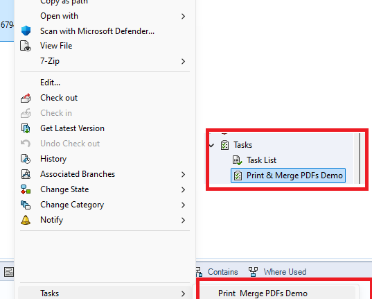

# Frequently Asked Questions

## Features

| Question | Answer |
|---|---|
| I'm getting some errors related to the bill of materials layout. | In recent versions, we have started using the PDM BOM instead of the SOLIDWORKS BOM. PDMPublisher will leverage the first BOM layout in your vault to calculate quantities. The layout must include a <RefCount> (Quantity) column and a <Configuration> (Configuration name) column. |
| How does PDMPublisher calculate the BOM quantities? | PDMPublisher creates a Bill of Materials in memory from the top-level assembly. It ignores all suppressed, virtual, envelope, and components that are excluded from the Bill of Materials. Most of these settings come from the component properties dialog. |
| How do the conditions work? | Conditions are evaluated for the found PDM reference. If any of the conditions evaluate to true, the reference is added to the processing queue. |
| I cannot see the exported files! | Make sure the export location in some where in your vault (or outside your vault) where you have the workflow and folder permissions to add and edit files. **The vault's root folder** is typically a folder that **is locked** for adding or editing files by PDM administrators. |
| I have created a task. How can I launch it?  | PDMPublisher tasks can be attached to a workflow transition or triggered from the right-click menu on a file. You will find your created tasks under Tasks. In the right-click menu, tasks use the name defined the task setup page. See below:  |

## Installation

|Question|Answer|
|---|---|
|I'm unable to consume my license|Make sure your system/firewall allows for connections to be made to httsp://bluebyte.biz on **port 443**. **[Contact](https://bluebyte.biz/contact/)** us if this problem still persists.|
|I’m running the add-in on assembly and it is not capturing all the references.|Make sure that the assembly and its references have local copies on the machine that runs the add-in. You can do that by doing a get-latest on the assembly and its references in the machine that runs the task. This is a by-design behavior of the PDM Publisher.|
|The task is unable to check in the log file.|This could be related to a number of issues. You may need to make sure the user running the add-in has proper file and folder permissions on the log folder. You also need to make sure that the txt file extension is NOT part of the **[auto-add user setting](https://help.solidworks.com/2017/english/enterprisepdm/admin/idd_page_file_adding.htm)**.|