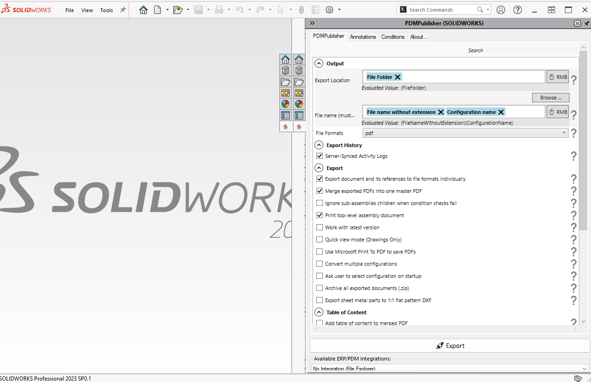

# PDMPublisher for SOLIDWORKS 

  

    <a href="https://bluebyte.biz/wp-json/slm_custom/downloadpdmpublisher" class="download-button" style="display: inline-block; padding: 10px 20px; background-color: #0078d7; color: white; text-decoration: none; border-radius: 5px; font-weight: bold;">
        📥 Download PDMPublisher>
    </a>
    <a href="https://bluebyte.biz/product/pdmpublisher-solidworks" class="download-button" style="display: inline-block; padding: 10px 20px; background-color:rgb(17, 78, 20); color: white; text-decoration: none; border-radius: 5px; font-weight: bold;">
        🛒 PDMPublisher License
    </a>

---
**PDMPublisher** is available as **SOLIDWORKS add-in**.

PDMPublisher for SOLIDWORKS 3D has *the same features* as PDMPublisher for SOLIDWORKS PDM Professional.

You can **download PDMPublisher for SOLIDWORKS for free** for SOLIDWORKS from the official product page:  

## Tabs

When you first run **PDMPublisher for SOLIDWORKS**, there are several tabs to get familiar with:

- [Options Tab (Defualt Tab)](pdmpublishersolidworks_options.md)
- [Annotations Tab](pdmpublishersolidworks_annotations.md)
- [Conditions Tab](conditions_solidworks.md)
- [Logs Tab](pdmpublishersolidworks_logs.md)
- [About Tab](pdmpublishersolidworks_about.md)

