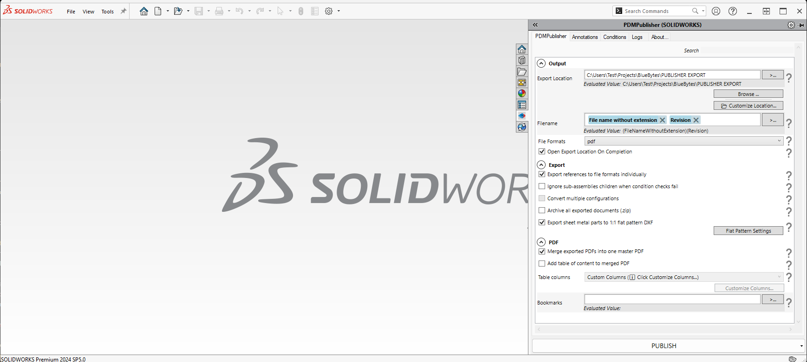

# PDMPublisher for SOLIDWORKS 

  

    <a href="https://bluebyte.biz/wp-json/slm_custom/downloadpdmpublisher" class="download-button" style="display: inline-block; padding: 10px 20px; background-color: #0078d7; color: white; text-decoration: none; border-radius: 5px; font-weight: bold;">
        📥 Download PDMPublisher>
    </a>
    <a href="https://bluebyte.biz/product/pdmpublisher-solidworks" class="download-button" style="display: inline-block; padding: 10px 20px; background-color:rgb(17, 78, 20); color: white; text-decoration: none; border-radius: 5px; font-weight: bold;">
        🛒 PDMPublisher License
    </a>

---
**PDMPublisher** is available as **SOLIDWORKS add-in**.

PDMPublisher for SOLIDWORKS 3D has *the same features* as PDMPublisher for SOLIDWORKS PDM Professional.

You can **download PDMPublisher for SOLIDWORKS for free** for SOLIDWORKS from the official product page:  

---

## Output

### Export Location
Defines the destination folder where exported files will be saved.  
**Example:**  
`File Folder`  
**Evaluated Value:** `(FileFolder)`

### File Name
Controls the naming convention for output files.  
**Example:**  
`File name without extension` + `Configuration name`  
**Evaluated Value:** `(FileNameWithoutExtension)(ConfigurationName)`

### File Formats
Specifies the format(s) to export files as.  
**Default:** `pdf`

---

## Export History

### Server-Synced Activity Logs
When enabled, logs export activity and syncs with the server.
### Server-Synced Activity Logs
When enabled, logs export activity and syncs with the server.

---

## Export Options

| Option                                                                 | Description                                                                                      |
|------------------------------------------------------------------------|--------------------------------------------------------------------------------------------------|
| Export document and its references to file formats individually       | Exports each referenced part or drawing as a separate file.                                      |
| Merge exported PDFs into one master PDF                               | Combines all exported PDFs into a single document.                                               |
| Ignore sub-assemblies children when condition checks fail             | Skips exporting sub-assembly children if conditional logic is not met.                           |
| Print top-level assembly document                                     | Only exports the top-level assembly instead of all components.                                   |
| Work with latest version                                              | Always export the most recently checked-in version of files.                                     |
| Quick view mode (Drawings Only)                                       | Speeds up drawing exports by avoiding full model load.                                           |
| Use Microsoft Print To PDF to save PDFs                               | Uses the Windows print driver instead of SOLIDWORKS built-in export.                             |
| Convert multiple configurations                                       | Supports export of all configurations in the model.                                              |
| Ask user to select configuration on startup                           | Prompts the user for configuration if not pre-defined.                                           |
| Archive all exported documents (.zip)                                 | Packages all exported files into a zip archive.                                                  |
| Export sheet metal parts to 1:1 flat pattern DXF                      | Automatically exports sheet metal parts as DXF in 1:1 scale.                                     |

---

## Table of Content

### Add table of content to merged PDF
If enabled, inserts a table of content at the beginning of the merged PDF.

### Table Type
Dropdown selection for TOC formatting style.  
**Default:** `TOC`

### Paper Size
Specifies paper size for the TOC page.  
**Default:** `A4`

---

## Watermark

### Watermark
Text or evaluated variable to apply as a watermark on exported files.  
**Evaluated Value:** As resolved at runtime.

---

## PDF Bookmarks

### PDF Bookmarks
Adds bookmarks into the PDF using the specified variable.  
**Default:** `{$Description}`  
**Evaluated Value:** `($Description)`

---

## ERP/PDM Integrations

### Available ERP/PDM Integrations
Displays the integration method for output.  
**Default:** `No Integration (File Explorer)` 

#### Supported ERP/PDMs:
- SOLIDWORKS PDM Professional 
- SharePoint

---

## Export

Click the **Export** button to run the configured export task using all defined options.

---