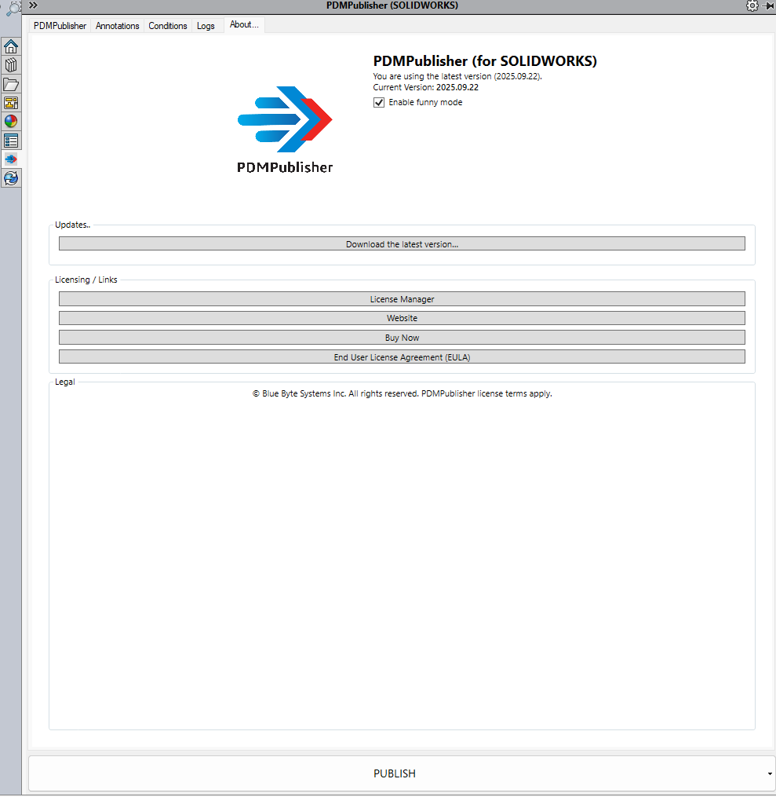

# About Tab

    <a href="https://bluebyte.biz/wp-json/slm_custom/downloadpdmpublisher" class="download-button" style="display: inline-block; padding: 10px 20px; background-color: #0078d7; color: white; text-decoration: none; border-radius: 5px; font-weight: bold;">
        📥 Download PDMPublisher (free version)
    </a>
    <a href="https://bluebyte.biz/product/pdmpublisher-solidworks" class="download-button" style="display: inline-block; padding: 10px 20px; background-color:rgb(17, 78, 20); color: white; text-decoration: none; border-radius: 5px; font-weight: bold;">
        🛒 Purchase a License
    </a>

This section outlines all the options in the **PDMPublisher** About tab:

---

The About tab is where you will find the following:

| Option                   | Description                                                                 |
|--------------------------|-----------------------------------------------------------------------------|
| **Enable funny mode**           | This provides some entainment on the progress bar! (does not affect performance)                           |
| **Download the latest version** | This is used to manually download the latest version of add-in.                                            |
| **License Manager**             | Opens the License Manager window. Here you can activate and deactivate your license.                       |
| **Website**                     | This will take you to the Blue Bytes website to access tons of usefule information and additional tools!   |
| **Buy Now**                     | Use this button to Purchase a license and take the add-in to the next level!                               |
| **ELUA**                        | End User License Agreement                                                                                 |

