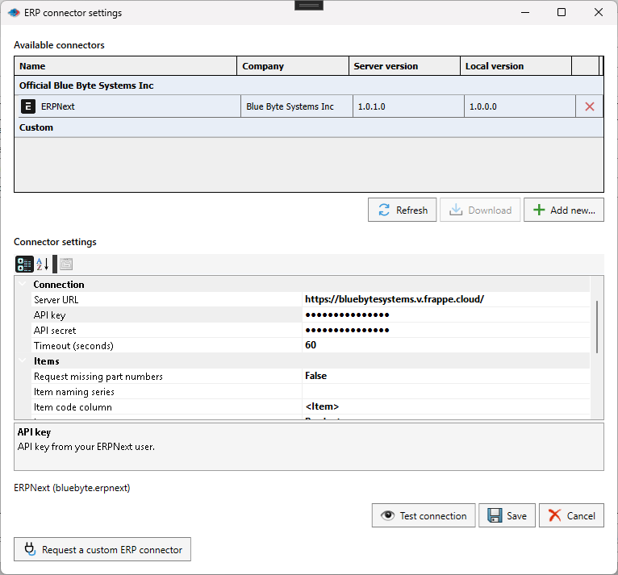

# ERPNext Connector

The ERPNext connector is an official Blue Byte Systems connector available from the PDMPublisher connector catalog. It pushes checked SOLIDWORKS rows to ERPNext as Items, updates mapped Item fields, can request ERPNext-generated part numbers, uploads optional files and previews, and synchronizes selected relationships to managed draft BOMs.

> [!NOTE]
> The connector is one-way. **Pull** is not available. It does not create stock movements, purchase orders, custom-field definitions, submitted BOMs, or active default BOMs.

## Prepare ERPNext

Before configuring PDMPublisher:

- Create an ERPNext integration user and generate its API key and API secret.
- Grant the user read, create, and write access to **Item** records in the intended synchronization scope.
- For file uploads, grant **File** creation and Item write access.
- For BOM synchronization, grant access to the configured company and permission to read, create, and update **BOM** records.
- Confirm that the configured Item Group and stock unit of measure already exist.
- Create any required `custom_*` fields on the ERPNext **Item** DocType. The connector maps values to existing fields; it does not define fields.
- When requesting missing part numbers, configure ERPNext Stock Settings to name Items by **Naming Series** and prepare the series that PDMPublisher should request.

Use an ERPNext test site or non-production company while validating permissions, required fields, workflows, and server scripts.

## Install the connector

1. Open **PDMPublisher > Settings > ERP Sync**.
2. Open **ERP connector settings** and select **Refresh**.
3. Select **ERPNext** under **Official Blue Byte Systems Inc**.
4. Select **Download** when the connector is not installed or a newer server version is available.
5. Select the installed ERPNext row to display its settings.
6. Enter the connection and synchronization settings, then select **Test connection**.
7. Select **Save** and restart SOLIDWORKS if an already loaded connector was replaced.

**Test connection** verifies authentication and Item read access without creating or changing ERPNext records. Create and write permissions are enforced when a Push operation runs.

## Connector settings

| Setting | Purpose |
| --- | --- |
| Server URL | HTTPS root URL of the ERPNext site, without `/api`, credentials, a query, or a fragment. |
| API key / API secret | Credentials for the ERPNext integration user. Both values are masked and stored in the encrypted settings for the current Windows user. |
| Timeout (seconds) | Per-request timeout from 1 to 300 seconds. The default is 60. |
| Item code column | ERP Sync column or custom property used as `item_code`. The default is `PartNumber`; there is no filename fallback. |
| Item group | Existing ERPNext Item Group assigned when a new Item is created. The default is `Products`. |
| Stock unit of measure | Existing ERPNext UOM assigned when a new Item is created. The default is `Nos`. |
| Skip empty values | Keeps existing ERPNext values when mapped source values are blank. Missing source properties are always omitted. |
| Request missing part numbers | Requests an Item code from ERPNext when the selected writable custom property is empty and writes the confirmed number back to SOLIDWORKS. |
| Item naming series | ERPNext Item naming series used when requesting missing part numbers. |
| Property mappings | Maps SOLIDWORKS properties or columns to supported ERPNext Item fields. The default maps `Description` to `description`. |
| Maintain stock | Default `is_stock_item` value for newly created Items. |
| Allow sales | Default `is_sales_item` value for newly created Items. |
| Allow purchase | Default `is_purchase_item` value for newly created Items. |
| BOM company | ERPNext company used for managed draft BOM synchronization. |
| Upload thumbnail | Attaches the captured SOLIDWORKS preview and sets it as the ERPNext Item image. |
| Upload exported files | Uploads existing files whose base filename matches the source model. It does not generate exports. |
| File extensions | Comma-separated attachment extensions. The default is `step,stp,dxf,pdf`. |
| Export folder | Folder containing exported files. Leave empty to use each source model folder; subfolders are not searched. |

## Map properties

1. Enter the server URL and API credentials.
2. Open **Property mappings > ...** and select **Load ERP fields**.
3. Select a SOLIDWORKS property or available ERP Sync column as the source.
4. Select the ERPNext field and save the connector settings.

Field discovery reads Item metadata but does not read Item values or write records. Supported targets are `item_name`, `description`, `is_stock_item`, `is_sales_item`, `is_purchase_item`, and writable scalar `custom_*` fields. Table, hidden, read-only, and unsupported fields are excluded.

Use ERPNext field names rather than labels. Boolean mappings accept `True/False`, `Yes/No`, or `1/0`. Numeric fields require invariant numeric text such as `12.5`. Property names are matched without case sensitivity, but Item codes are compared exactly.

## Push Items and properties

1. Open [ERP Sync](pdmpublishersolidworks_erp-sync.md) for a saved SOLIDWORKS document.
2. Prepare the rows and check only the Items to send.
3. Select the ERPNext connector.
4. Open the arrow beside **Push** and choose **Properties**, **Create items + properties**, **BOM**, or a supported combination.
5. Select **Push** and review every row result and the summary.

**Properties** requires every checked Item to exist. **Create items + properties** creates missing Items and updates mapped fields. Existing Items retain their identity, Item Group, stock UOM, and unrelated ERP fields. Repeated rows with the same Item code and values are sent once; conflicting values stop the batch before writing.

## Request missing part numbers

Enable **Request missing part numbers**, choose a writable custom property as **Item code column**, and enter the ERPNext naming series. Empty values cause ERPNext to assign an Item code; confirmed numbers are written back to the matching model or cut-list rows.

The SOLIDWORKS documents are marked modified but are not saved automatically. Save them to retain the generated numbers. Existing numbers are not replaced. Grouped, aggregate, or phantom rows cannot receive generated numbers.

## Upload previews and exported files

Uploads are private ERPNext attachments. Exported files must already exist with the same base filename as the source model, for example `Bracket.SLDPRT` and `Bracket.step`. Missing files and previews are skipped and counted. A file larger than 20 MB stops the operation before Item writes.

Repeated instances upload once per Item during a Push. Later Push operations can create additional File records; existing attachments are not removed.

## Synchronize draft BOMs

BOM synchronization requires an **Indented** ERP Sync view with no grouping and a configured **BOM company**. Check each parent assembly and the direct children to include. A checked assembly with no checked children is skipped.

The connector creates or updates its own marked draft BOM for the source file, configuration, and company. Each successful synchronization replaces that draft's material list with the checked-child snapshot. It does not submit, activate, or set the BOM as default, and it does not modify submitted BOMs or unrelated drafts.

## Handle failures safely

The connector stops on the first API error and does not automatically retry or roll back completed changes. If a request times out or a response cannot be confirmed, the write may still have reached ERPNext. Check the reported Item, attachment, or BOM in ERPNext before retrying.

When generated numbers were confirmed before a later failure, PDMPublisher returns them for local write-back. If local write-back fails, use the reported values for recovery rather than requesting replacements.

## Related pages

- [ERP Sync](pdmpublishersolidworks_erp-sync.md)
- [Create a Custom ERP Connector](pdmpublishersolidworks_erp-connector.md)

