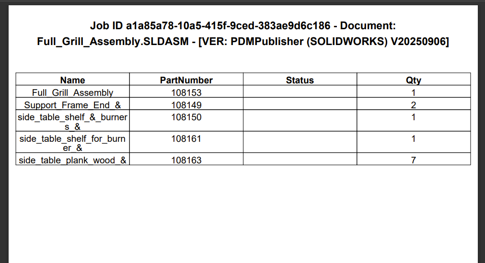

# PDMPublisher for SOLIDWORKS 

    <a href="https://bluebyte.biz/wp-json/slm_custom/downloadpdmpublisher" class="download-button" style="display: inline-block; padding: 10px 20px; background-color: #0078d7; color: white; text-decoration: none; border-radius: 5px; font-weight: bold;">
        📥 Download PDMPublisher (free version)
    </a>
    <a href="https://bluebyte.biz/product/pdmpublisher-solidworks" class="download-button" style="display: inline-block; padding: 10px 20px; background-color:rgb(17, 78, 20); color: white; text-decoration: none; border-radius: 5px; font-weight: bold;">
        🛒 Purchase a License
    </a>

This section outlines all the options in the PDMPublisher home tab:

---

## Export Location

Location where to export the files. 

  - The location can be in or outside  SOLIDWORKS PDM vault.
  - The Browse button allows the user to specify the destination folder for the exported files, making it easy to direct them to any desired location.
  - The export location can be defined dynamically, allowing the destination folder to be determined by the selected file properties.
  - Must not end with `\`.

## Customize Location
Custom export locations based on file extension.

  - Customize location allows users to define export locations based on file extension, ensuring that each file type is assigned a unique destination path. 
  - The checkboxes indicate which file types will be exported to their specified locations. Any file type whose checkbox is not selected will default to the base export location.

>[!NOTE]
> This feature is available exclusively in the full version of PDMpublisher.

---

## File name (must include extension)

Exported file name(s).

 - The Filename field defines the name assigned to the generated file(s). 
 - This value is determined by the properties selected within the add-in.
 - Characters can be manually entered between dynamic properties to separate the properties. For example: filename`_`revision (Certain characters are not permitted in filenames due to Windows Explorer restrictions)

>[!NOTE]
> The list of SOLIDWORKS properties available for use in the filename is determined by the active document and the specific properties it contains.

---

## File Formats

File formats to export.

Multiple file formats can be exported simultaneously by checking the corresponding boxes.

The supported file formats are: 

- PDF
- DWG
- DXF
- IGS
- U3D
- STL
- STEP
- EPRT
- EASM
- HTML (Requires eDrawings Professional to be installed)
- X_T

---

## Export document to file formats individually

Export individual files.

When enabled, this exports the document and its referenced documents individually to the selected output folder. This does not affect merging and archiving when it is off.

---

## Merge exported PDFs into one master PDF

Merger all PDFs into a combined document.

When enabled, all exported PDFs of the affected assembly are merged into a single PDF.

---

## Ignore sub-assemblies children when condition checks fail

Condition check on parent assemblies will ignore children when failed.

When conditions are applied and this option is enabled, the children of sub-assemblies that fail the condition checks will be ignored (not processed). 

---

## Archive all exported documents (.zip)

Create a zip file of all exported documents.

---

## Convert multiple configurations

Convert all part and assembly configurations. 

When enabled, this option processes each configuration individually and exports them according to the selected criteria.

>[!NOTE]
> Configuration Name is required in the filename field. (shown below)

---

## Add table of content to merged PDF

Creates a table of contents for a merged PDF export.

 - When enabled, automatically generates and inserts a table of content into the merged PDF.
 - Users can choose to use the default settings or customize values to suit their specific requirements.
 - Custom values are derived from the SOLIDWORKS file properties of the currently active document.

- The example below shows a custom 'PartNumber','Status', and 'Qty' column. When a property does not exist in the SOLIDWORKS file(s), the column will be blank.

---

## Convert sheet metal parts to 1:1 flat pattern DXF

Exports the flat pattern of sheet metal parts as 1:1 DXF.

 - The term 'FlatPattern' will be appended to the filename.
 - This feature will recongize sheet metal parts and export them as a flat pattern.

 >[!NOTE]
> This does not require the DXF file format to be selected for export in the File Formats.

---

## PDF bookmarks

Add bookmarks to merged PDFs.

Define the pattern to use for bookmarks in the merged PDF (e.g., chapter titles, part names).

