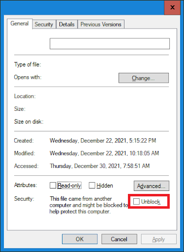

# A file I downloaded (like a SOLIDWORKS PDM add-in) isn't working. How do I check if it's blocked?

>[!WARNING]
> **Please unblock your downloads. Blocked files will affect the proper execution of our products in your systems**.

 

If a file downloaded from the internet (such as a SOLIDWORKS PDM add-in, macro, installer, or script) doesn’t load or execute, Windows might be blocking it for security reasons. Follow these steps to unblock it:

- **Locate the File:** Open File Explorer and navigate to the downloaded file.

- **Right-click the File:** Right-click the file to bring up the context menu.

- **Go to Properties:** Click "Properties" at the bottom of the context menu.

- **Check for Blocking:** In the **General** tab, look for a checkbox labeled **“Unblock”** near the bottom. If you see it, the file is being blocked by Windows.

- **Unblock the File:** Check the **“Unblock”** box and click **“Apply”**, then **“OK”**.

- **Verify:** Reopen the Properties window to ensure the "Unblock" checkbox is gone.

After unblocking, the file should work normally without being blocked by Windows' security mechanisms.

 

  

> [!NOTE]
> Windows may block files from external sources to protect your system. This includes files that are:
>
> **✅ Downloaded from the Internet**
> - Files from websites, cloud storage, or software vendors may be automatically blocked.
>
> **📩 Received as Email Attachments**
> - Especially those from unknown or untrusted senders.
>
> **🔌 Copied from External Devices**
> - USB drives, shared network locations, or remote servers can mark files as untrusted.
>
> **⚙️ Controlled by Security Policies**
> - Files are tagged with a zone identifier (e.g., “from the internet”) and may be restricted based on system or group policy settings.

---

Unblocking the file ensures Windows will no longer prevent it from running—just make sure the source is trusted.