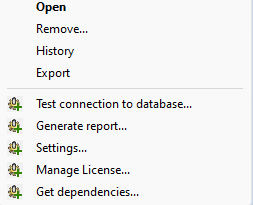
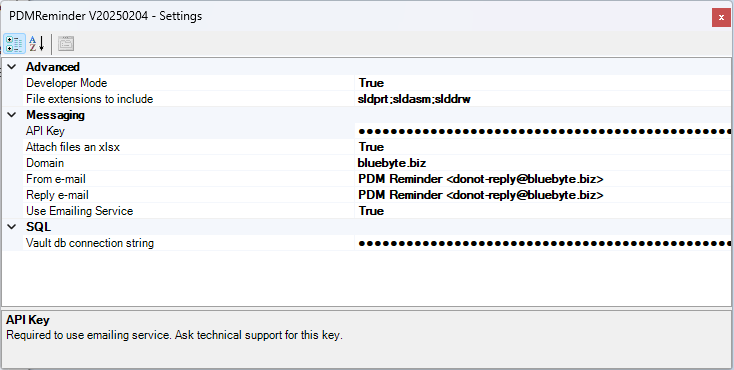
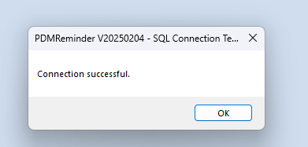
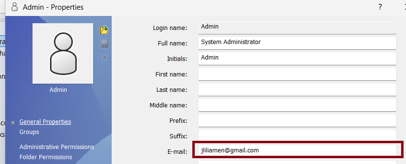
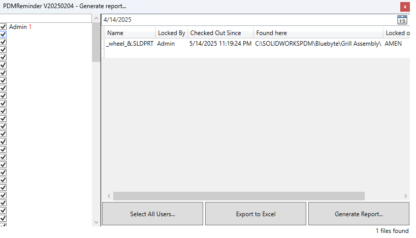

## Configuration 

This configuration menu is accessed by right-clicking on the PDMReminder add-in under the Add-ins node in the SOLIDWORKS PDM Administration tool. It provides quick access to essential functions such as testing the database connection, configuring settings, generating reports, managing the license, and viewing dependencies. These options are intended for administrators to manage and troubleshoot the add-in effectively.

| Menu Item                     | Description                                                                 |
|------------------------------|-----------------------------------------------------------------------------|
| Test connection to database... | Verifies if the database connection is valid and accessible.                |
| Generate report...           | Creates a summary report of reminders and their current status.             |
| Settings...                  | Opens the configuration panel for general settings like email or scheduling.|
| Manage License...            | Allows activation, validation, or viewing of the current license.           |
| Get dependencies...          | Lists required files or components needed for the tool to work properly.    |

---
### Settings

| Category   | Setting Name              | Value                            | Description                                                                 |
|------------|---------------------------|----------------------------------|-----------------------------------------------------------------------------|
| Advanced   | Developer Mode            | True                             | Enables developer-specific options or debug info.                          |
| Advanced   | File extensions to include| sldprt;sldasm;slddrw             | File types to monitor for reminders.                                       |
| Messaging  | API Key                   | ●●●●●●●●●●●●●●●●●●●●●●●●●●●●●●●●  | Required to use the emailing service (contact support for access).         |
| Messaging  | Attach files as xlsx      | True                             | Sends reminder attachments as Excel files.                                 |
| Messaging  | Domain                    | bluebyte.biz                     | Sets the domain used in email links or references.                         |
| Messaging  | From e-mail               | PDM Reminder <donot-reply@bluebyte.biz> | Sender email address for outgoing reminders.                       |
| Messaging  | Reply e-mail              | PDM Reminder <donot-reply@bluebyte.biz> | Reply-to address for responses.                                     |
| Messaging  | Use Emailing Service      | True                             | Enables or disables the external emailing service.                         |
| SQL        | Vault db connection string| ●●●●●●●●●●●●●●●●●●●●●●●●●●●●●●●●  | Connection string to read data from the PDM SQL database.                  |

> [!Note]
> All settings are automatically saved when the user closes the window.

---
### Test connection to database...

To avoid a lengthly configuration, we have enabled a test command to validate using the add-in's connection with the database.  
> [!Warning]
> Only use this option after you've properly configured the connection string (**Vault db connection string**).

You can generate a connection string using [connectionstrings.com](https://www.connectionstrings.com/sql-server/).

> [!Warning]
> Make sure to use a **read-only** connection string to prevent any accidental changes to the PDM database.

If your connection string has been properly configured in the settings, you should get this dialogbox after you click *Test connection to database...*:

---

### Important notes about the **Emailing Service**

- If **Use Emailing Service** is set to false, **PDMReminder** will use the PDM built-in messaging engine. 
- If **Use Emailing Service** is set to true, **PDMReminder** requires PDM user to have a valid e-mail: 

   

---
### Generate Report 

The **Generate report...** window in **PDMReminder** provides administrators with a visual summary of files that match reminder criteria—such as being checked out too long or locked by a user.

#### Features and Commands

| Element                      | Description                                                                 |
|------------------------------|-----------------------------------------------------------------------------|
| **User List (left panel)**   | Displays a list of all users with checkboxes to include or exclude them from the report. |
| **Date Picker (top center)** | Allows filtering results by a specific date, showing files relevant to that day. |
| **Results Grid (right panel)** | Displays the report of the files that match the search parameters.  
| **Select All Users...**      | Select or deselect all users in the report.          |
| **Export to Excel**          | Exports the currently visible results to an `.xlsx` file for reporting or review. |
| **Generate Report...**       | Runs the report based on the selected filters and users.                    |
| **File Count (bottom right)**| Displays the total number of files found, e.g., `1 files found`.            |

> ℹ️ **Note:** The report dynamically updates based on the selected users and date filter.