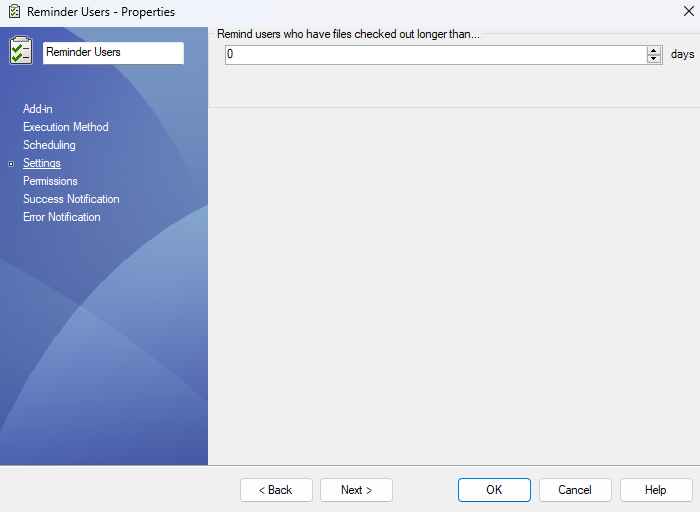

### Step-by-Step Instructions

1. **Right-click "Tasks" in the PDM Admin Tool**  
   Go to your vault (e.g., `bluebyte`) and right-click the **Tasks** node. Select **New Task...**.

2. **Choose the Add-in**  
   In the **Add-in** dropdown, select **PDMReminder**. This add-in must already be imported into the vault.

3. **Go to the Settings tab**  
   
    

    The **Settings** tab allows you to define the condition that triggers the reminder:  
    
    - **"Remind users who have files checked out longer than..."** a specified number of days. This is the core rule that determines which users will receive a reminder—based on how long their files have remained checked out in the vault.
    - For example, entering `3` days will only include users with files checked out for more than 3 days.

4. **Configure the Scheduling tab**  
   Set how often the task runs (e.g., daily at 7:00 AM). This ensures users get regular notifications and helps enforce good vault hygiene.
