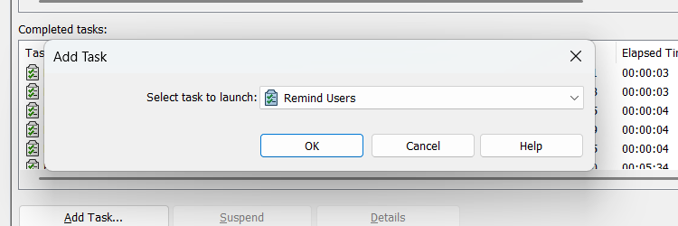

### Step-by-Step Instructions

1. **Right-click "Tasks" in the PDM Administration tool**  
   Go to your vault (e.g., `bluebyte`) and right-click the **Tasks** node. Select **New Task...**.

2. **Choose the Add-in**  
   In the **Add-in** dropdown, select **PDMReminder**. This add-in must already be imported into the vault.

3. **Go to the Settings tab**  
   
    

    The **Settings** tab allows you to define the condition that triggers the reminder:  
    
    - **"Remind users who have files checked out longer than..."** a specified number of days. This is the core rule that determines which users will receive a reminder—based on how long their files have remained checked out in the vault. For example, entering `3` days will only include users with files checked out for more than 3 days.
    
4. **Configure the Scheduling tab**: Set how often the task runs (e.g., daily at 7:00 AM). This ensures users get regular notifications and helps enforce good vault hygiene.

5. **Configure the exection method and permissions tab.**

6. If you have scheduled a task, it will run according to the interval and frequency set.

7. *Optional*: You can trigger the task to run immediately, clicking on **Add Task...**

### Results 
If you use the **Emailing Service**, PDM users will receive an email similar this the following: 

### Considerations for Using the Email Service

Before enabling the **Emailing Service**, keep the following points in mind:

1. **Additional Fees**:  
   The Emailing Service may incur additional fees depending on your subscription plan. Ensure you review the pricing details before enabling this feature.

2. **Email Delivery Issues**:  
   Emails sent through the service are sent from outside your organization's domain. This could result in emails being flagged as spam or blocked by your organization's email filters. To mitigate this, consider whitelisting the sender's domain or consulting with your IT department.

By understanding these considerations, you can make an informed decision about whether to enable the Emailing Service for your PDMReminder tasks.
