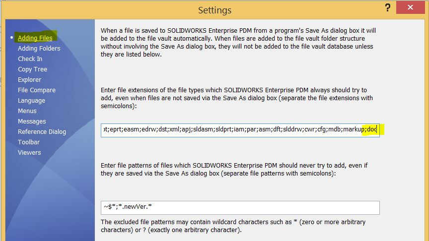
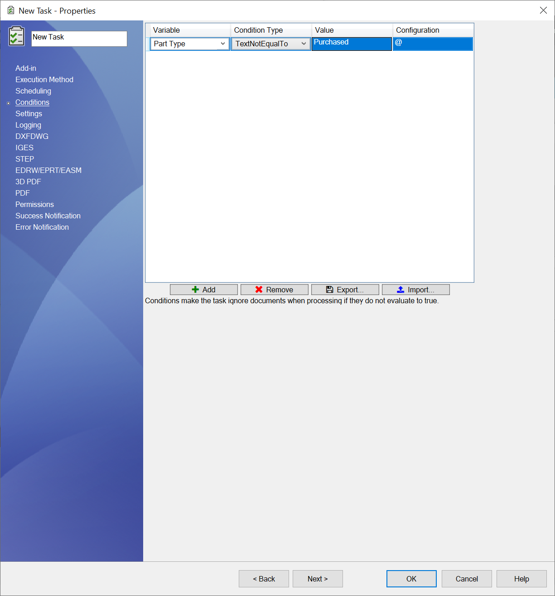

# Properties page

This section will detail the setup pages that require explanation.

## Options Setup Page

When you choose PDM Task Convert Extended from the dropdown in the new task dialog, you will be prompted a window that is similar to the one below:

|Option|Description|
|:---|:---|
|**Output**|This is where you specify the location where you want the exported documents to be saved. This location can be inside or outside the vault.|
|**Extensions**|These are the extensions the task should export. Supported extensions are: <ul><li>PDF</li><li>DXF</li><li>DWG</li><li>IGES</li><li>X_T</li><li>STEP</li><li>eDrawings<ul><li>eprt</li><li>easm</li><li>edrw</li></ul><li>U3D (3D PDF)</li><li>HTML (You need eDrawings Professional 2019-2023 installed on the machine that runs the task.)</li></li></ul>|
|**Logging**|<ul><li>Specify if you want the logs to be stored in the cloud.</li><li>Specify where you want the logs to be saved. The location must be in PDM.</li></ul>|
|**Export**|<ul><li>Export referenced documents of assemblies: This means that if the processed file is an assembly, the task will attempt to export all the available references from the assembly.</li><li>Merge referenced documents<ul><li>This will merge all exported PDFs.</li></ul><li>Export all configurations<ul><li>This will attempt to export all configurations of parts and assemblies.</li><li>Please make sure you include the configuration name alias in the output filename.</li></ul></li><li>Work with latest version<ul><li>Task will attempt to get the latest version of the file to be printed.</li></ul></li><li>QuickView<ul><li>Opens documents in quick view or large design mode.</li><li>This option will increase performance with large documents.</li></ul><li>Archive<ul><li>Creates a zip file of the processed files</li></ul></li><li>Applies conditions<ul><li>Does not apply conditions when processing assemblies.</li></ul><li>Export sheet metal parts<ul><li>When enabled, task attempt to open referenced sheet metal parts from their drawing document and export their flat pattern as the specified dxf or dwg extension.</li><li>This option will not work if drawings are opened in quick view mode.</li><li>The notation flatPattern will be appended to the filename of the flat pattern.</li></ul></li></ul>|
|**Watermark**|Add a watermark to the printed PDF. You can use the special value **($CustomProperty)** if the value of the desired watermark is found in a custom property.|
|**Quantity**|Add the document quantity from the calculated BOM of the top-level assembly. Two options:<ul><li>Using custom property in your sheet format. Task writes quantity to custom property and rebuilds drawing.</li><li>Define the location and pretext of a note the task adds to drawing before printing to DPF. Use this option if you do not have a predefined custom property in your sheet format</li></ul>|

### Important Notes About Creating Tasks

Please consider the following recommendations when creating a new task using PDM Convert Task Extended:
1. **Execution method**
    1. In the execution method tab that appears on the blue left sidebar, please: 
    2. Choose the radio box option **“Let the system decide which computer to execute the task“**.
    3. Choose **one computer**. We recommend that our customers opt for the server. The server needs to have a SOLIDWORKS PDM Client installed with a local view as well as SOLIDWORKS 3D.
2. On the first page of the task, execute the task with a user that has the right workflow and file/folder permissions.

> [!TIP]
> We also recommend disabling the auto-add extensions by removing all the extensions the task uses including txt.  
> This prevents race conditions between SOLIDWORKS PDM and the task during files add process.

To change the auto-add extensions list, 
1. *Go to* the PDM Administration tool
2. *Right click* on the username (or all users)
3. *Select* ***Settings***
4. *Click* on the ***Adding Files*** selection and edit the file extensions

## Conditions Setup Page

Conditions can be added to a task to include or exclude files from being processed.  
The task will only process files that evaluate all of the set conditions as *true*.

> [!NOTE]
> The condition above for example will only allow files where the Part Type variable from the @ tab is different than the value Purchased.

To add a condition, *click* the ***Add*** button.

### Condition Options

|Option|Description|
|---|---|
|**Variable**|Variable name with the run the condition on.|
|**Condition Type**|Operation type to process.|
|**Value**|Value to evaluate the condition against.|
|**Configuration**|Configuration: Specify the configuration from which to get the value of the variable. Use @ in general.|

## Notes Setup Page

Notes can be added to converted PDF documents via this the ***Notes*** setup page.

To add a note, *click* the ***Add*** or ***Import...*** button.  
A note is defined by:
1. Location
    - Use the sliders on the right side of the note text area to define the location.
2. Value
    - The text area allows combinations of text and special values. The special values are evaluated for you during the task execution.

