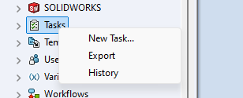
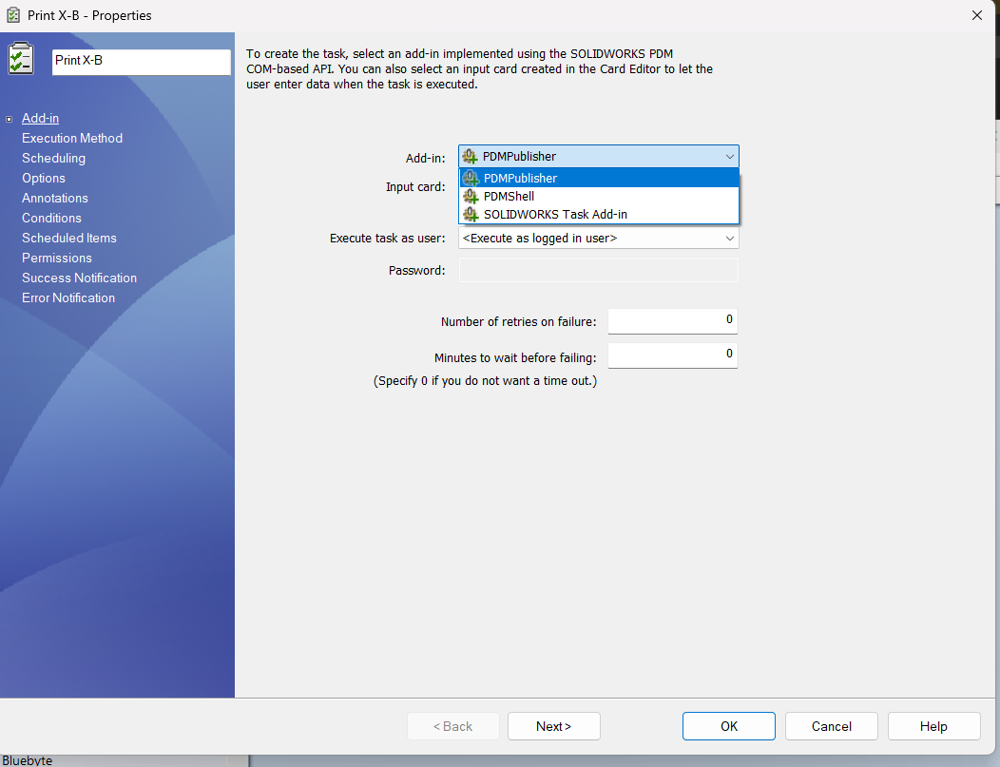
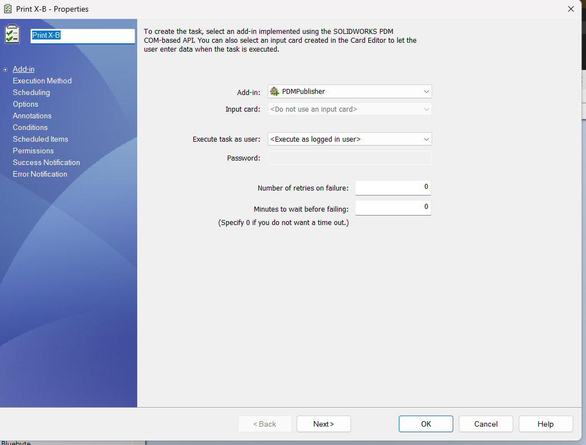
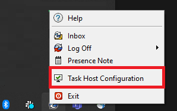
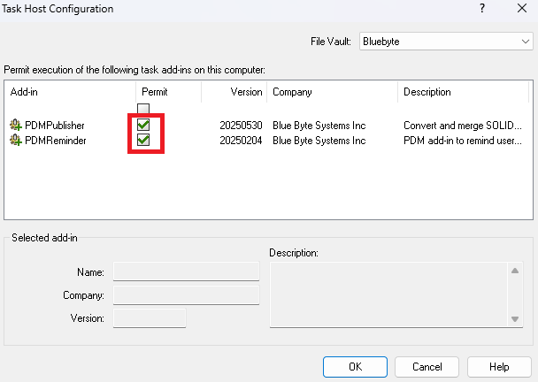
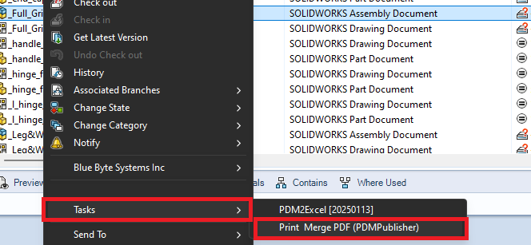
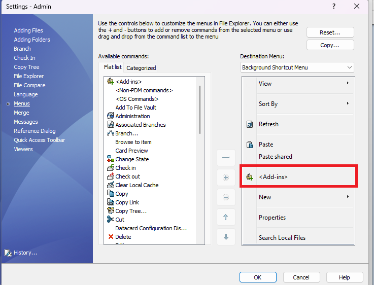
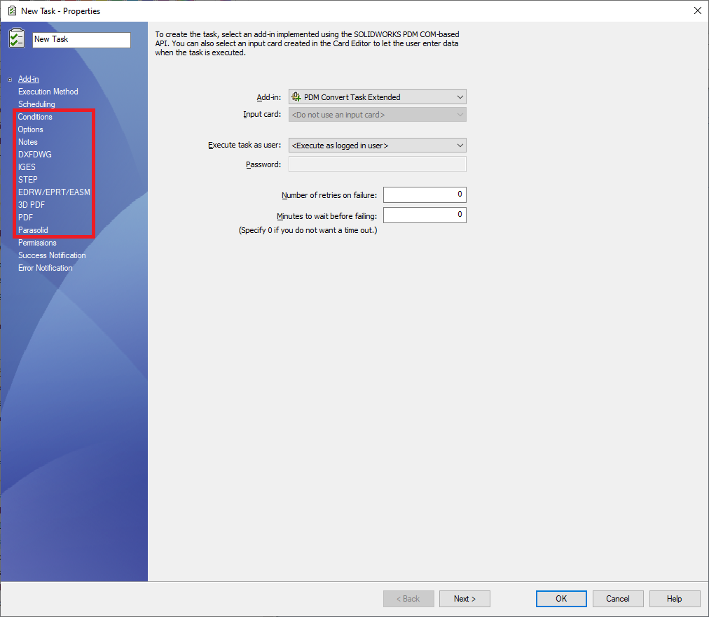

---
title: Creating a new task | PDMPublisher | SOLIDWORKS PDM
description: This section will detail the setup pages that require explanation.
ms.date: 06/20/2026
ms.topic: conceptual
---
# Setting your first task

> [!NOTE]
> This article *requires* that:
> - **PDMPublisher** has been added to your vault.
> - you can have activated your license. [Follow instructions in this article to do that](../src/licensespdmpublisher.html). 

## Your first task

To create a new task with **PDMPublisher**: 

- Right-click on *Tasks* in the Administration tool and click *New Task...*
  

    
  

- Choose a unique name for the task.
- Choose **PDMPublisher** from the **Add-in** dropdown on the first page of the task setup dialog.
  

    
  

- After selecting **PDMPublisher**, click **Next** to continue.
  

    
  

- Configure the *Execution Method* page to allow which computers in your organization's network to run the task. 
  - If the computers list is empty, right-click on the SOLIDWORKS PDM icon in the icon tray to access the *Task Host Configuration*.
    

      
    

  - You must *permit* **PDMPublisher** in the *Task Host Configuration* dialog. 
    

      
    

- Configure the setup pages:
  - **Options**
  - **Annotations**
  - **Conditions**
  - **Scheduled Items**
- Click OK to save your task. 
- Your task will be accessible from the right-click menu Under *Tasks* in your vault's File Explorer:
  

    
  

> [!WARNING]
> If you **do not see** the *Tasks* menu in File Explorer, it is possible that your PDM user setting have been configured to hide add-ins. You can configure the user settings dialog in the Administration tool:
> 

>  
> 

---

## Setup Pages

  

|Tab|Description|
|:---|:---|
|[Options](../src/options.html)|Options define how files will be printed. See the options page for more details.|
|[Annotations](../src/annotations.html)|Defines aliased notes that can contain text and datacard variables and define their locations in the drawing.|
|[Conditions](../src/conditions.html)|Defines which files to include in the save queues when processing top-level assemblies.|
|[Scheduled Items](../src/scheduleditems.html)|Defines a saved list of files for the task to process. If this list contains files, it takes priority over files selected from the right-click Tasks menu.|
