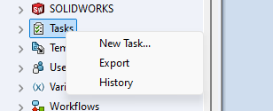
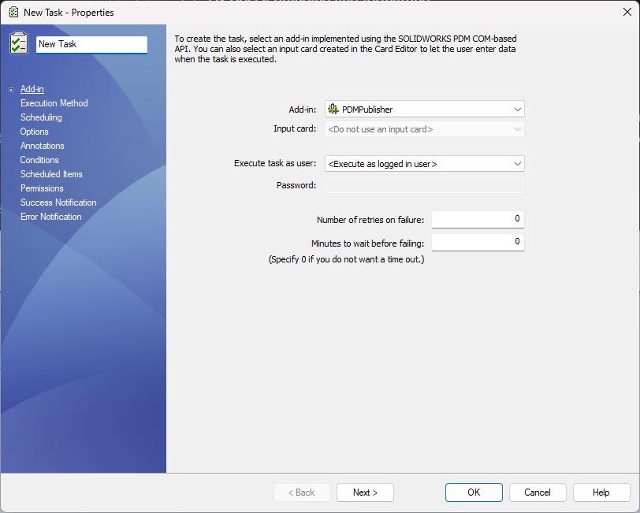
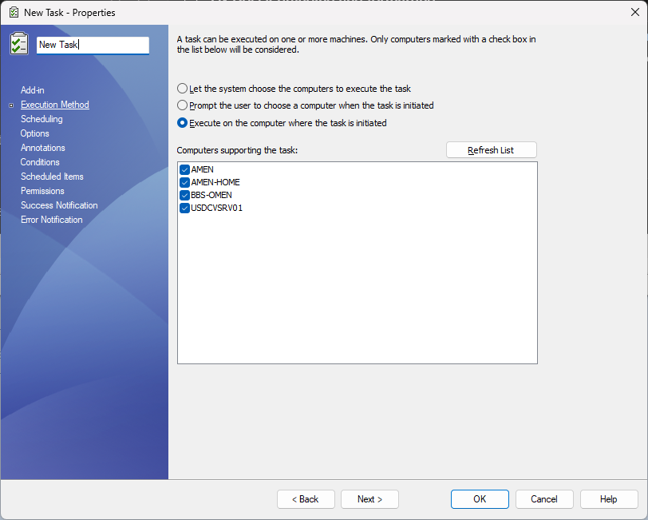
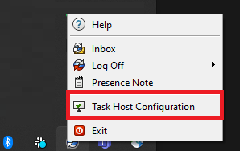
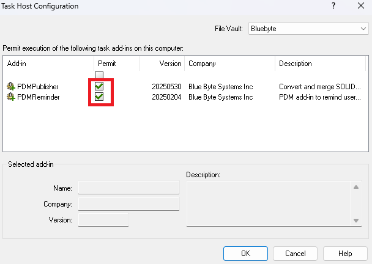
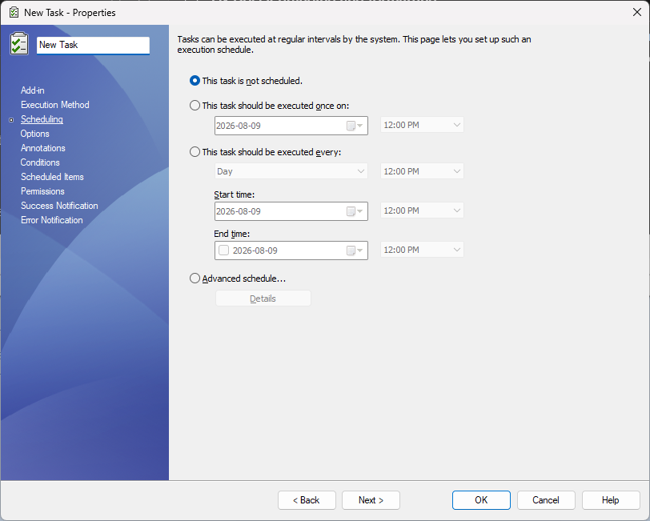
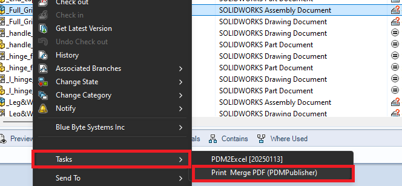

# Set Up Your First PDMPublisher Task

Read time: 2 minutes

> [!NOTE]
> Before creating a task, make sure:
> - **PDMPublisher** has been added to your vault.
> - You have activated your license. See [Licensing](licensespdmpublisher.md).
>
> After validating the license and before saving your first task, review these important settings:
> - Select the correct [Template](pdmpublisher-options/template.md). This is critical when PDMPublisher needs to calculate assembly references, configurations, or quantities.
> - Confirm [Use this version of SOLIDWORKS](pdmpublisher-options/use-this-version-of-solidworks.md) points to a SOLIDWORKS version installed on the task host computer.
> - Set a valid [Export Location](pdmpublisher-options/export-location.md) and [Filename](pdmpublisher-options/filename.md). Avoid trailing backslashes in export paths, and use filename placeholders such as revision, configuration, or sheet name when one source file can create multiple outputs.
> - If you need troubleshooting records, enable [Turn on Activity Tracking](pdmpublisher-options/turn-on-activity-tracking.md) and set [Log Folder (Vault Only)](pdmpublisher-options/log-folder-vault-only.md) to `(VaultRootFolder)\Logs\PDMPublisher`. Create this folder manually and make sure the user running the task, or the task host account, can add log files there.

## Create the Task

1. Open the SOLIDWORKS PDM Administration tool.

2. Right-click **Tasks**, then select **New Task...**.

   

     
   

3. Enter a unique name for the task. Use a name that clearly describes what the task exports, then review the notes above before saving.

4. On the **Add-in** page, choose **PDMPublisher** from the **Add-in** dropdown.

   

     
   

5. Click **Next**.

6. On the **Execution Method** page, choose which computers are allowed to run the task.

   This page comes after the add-in selection. Only computers checked in this list are considered as task execution machines.

   

     
   

   If the computer list is empty, right-click the SOLIDWORKS PDM icon in the Windows tray and open **Task Host Configuration**.

   

     
   

7. In **Task Host Configuration**, permit **PDMPublisher** on the task host computer.

   

     
   

8. Configure the **Scheduling** page if SOLIDWORKS PDM should launch this task automatically. See [Scheduled Items](scheduleditems.md) when the scheduled task should process a saved list of files.

   

     
   

   Scheduling is SOLIDWORKS PDM's own scheduling framework. It controls when the task starts.

9. Review the PDMPublisher setup pages listed below.

10. Click **OK** to save the task.

The task appears in File Explorer under **Tasks** in the right-click menu.

If the **Tasks** menu does not appear, see [Why is the Tasks menu missing?](pdmpublisher-task-menu-missing.md).

  

## Setup Pages

Use these pages to configure what PDMPublisher exports and how it handles each file.

| Tab | Use this page to |
| --- | --- |
| [Options](options.md) | Configure file formats, output paths, filenames, SOLIDWORKS version, templates, logs, and other export behavior. |
| [Annotations](annotations.md) | Add notes or watermarks that can include fixed text, PDM variables, and SOLIDWORKS properties. |
| [Conditions](conditions.md) | Decide which referenced files should be included when processing assemblies. |
| [Scheduled Items](scheduleditems.md) | Define files that should be processed when the task runs without selected files. |

### Options

Review the recommended setup items in [Options Task Page](options.md), especially export location, filename, file formats, SOLIDWORKS version, template, and activity tracking.

### Annotations

The annotation table is the workspace where you create and manage notes or watermarks that will be placed on exported PDFs. Each annotation can have its own text, formatting, position, sheet rule, and active state.

### Conditions

Use conditions to control which referenced files are processed when publishing assemblies.

### Scheduled Items

Use Scheduled Items when this task should always process a saved list of files. Scheduled Items override other selected files.
