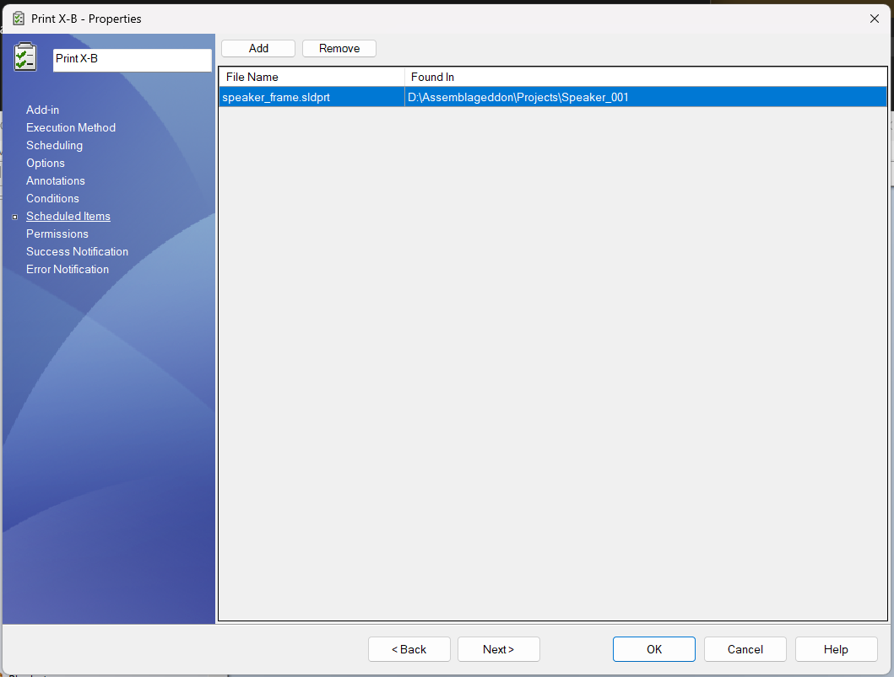
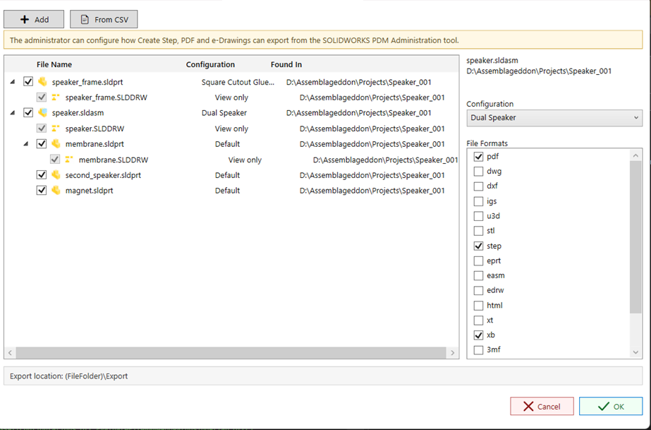

---
title: Scheduled Items Task Page | PDMPublisher | SOLIDWORKS PDM
description: Learn how to use the Scheduled Items task setup page in PDMPublisher to define files that should be processed when a task runs without selected files.
ms.date: 06/21/2026
ms.topic: conceptual
---
# Scheduled Items Task Page

The **Scheduled Items** page lets administrators define the files PDMPublisher should process when a task is launched without selected files.

This is useful for scheduled tasks and automated task launches where SOLIDWORKS PDM does not provide a file selection to the task at runtime.

  

## When to use this page

Use **Scheduled Items** when the task is expected to run on a schedule or from an automation that does not pass selected files to PDMPublisher.

If files are configured on this page, PDMPublisher uses the Scheduled Items list as the task input.

> [!IMPORTANT]
> Scheduled Items take priority over files selected from the right-click **Tasks** menu or any other launch method that passes selected files to PDMPublisher. If this page contains files, PDMPublisher processes the files listed here and ignores the files selected during launch. Only configure Scheduled Items for tasks that are intended to process the same saved list of files.

## Adding files

Click **Add** to choose one or more SOLIDWORKS files from the vault.

PDMPublisher stores the selected file ID and parent folder ID. These IDs are used later to rebuild the task input list when the scheduled task runs.

The table displays:

|Column|Description|
|:---|:---|
|File Name|The selected file name.|
|Found In|The vault folder where the file was selected.|

## Removing files

Select one or more rows and click **Remove** to remove them from the scheduled item list.

## Important notes

- The selected files must remain available in the vault.
- The task host must have permission to access the selected files and their folders.
- The task still uses the settings from the other setup pages, including **Options**, **Annotations**, and **Conditions**.
- If this page contains files, those files are used even when the task is launched from a selected file in File Explorer.
- If no files are selected at launch and no scheduled items are configured, the task will stop with an error.

## Selecting files at task launch

Version **2026.06.21** adds an interactive file selection dialog for tasks configured to ask the user which files to process at launch.

  

The dialog lets the user:

- Add files from the vault.
- Import file names from a CSV file.
- Review automatically calculated assembly references.
- See related drawings as view-only child rows.
- Choose launch-specific file formats for the task run.
- Review the configured export location before starting the task.

The warning at the top reminds users that task export behavior is configured by an administrator in the SOLIDWORKS PDM Administration tool.

### CSV import

Click **From CSV** to import files from a comma-separated file list.

PDMPublisher reads file names from a recognized file column such as `filename`, `file`, `filepath`, or `path`. If no recognized header is found, PDMPublisher scans each row for the first usable file name. Full paths are supported because only the file name is used for the vault search.

For each imported row, PDMPublisher searches the vault and uses the first matching result. Duplicate files already shown in the dialog are skipped.

### Drawing rows

When a referenced part or assembly has an associated drawing, the drawing is shown under that item for review. Drawing rows marked **View only** are not passed to the task input list. They are checked only when a 2D output format such as `pdf`, `dwg`, or `dxf` is selected and the parent file is checked.
